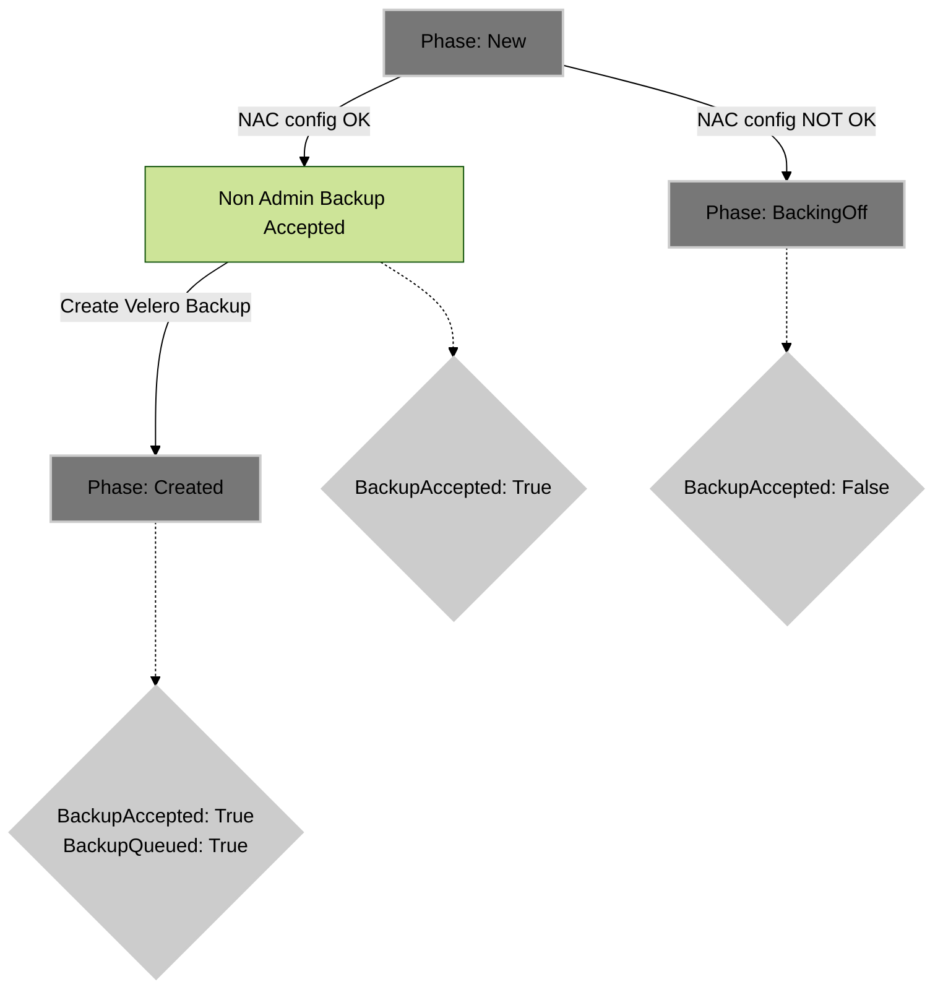

# Developer Workflow: NonAdminBackup Phase and Conditions within NonAdminBackup Status

## Overview

This document outlines the design around updating NonAdminBackup objects Phase and Conditions within Status.

### Phase

A NonAdminBackup's `status` field has a `phase` field, which is updated by NAC controller.

The `phase` is a simple one high-level summary of the lifecycle of an NonAdminBackup.

It is always a one well defined value, that is intended to be a comprehensive state of a NonAdminBackup.

Those are are the possible values for phase:

| **Value** | **Description**                 |
|-----------|--------------------------------|
| New | *NonAdminBackup resource was accepted by the OpenShift cluster, but it has not yet been processed by the NonAdminController* |
| BackingOff | Velero *Backup* object was not created due to NonAdminBackup error (configuration or similar) |
| Created | Velero *Backup* was created. The Phase will not have additional informations about the |

### Conditions

The `conditions` is also a part of the NonAdminBackup's `status` field. One NAB object may have multiple conditions. It is more granular knowledge of the NonAdminBackup object and represents the array of the conditions through which the NonAdminBackup has or has not passed. Each `NonAdminCondition` has one of the following `type`:

| **Condition** | **Description**                 |
|-----------|--------------------------------|
| BackupAccepted | The Backup object was accepted by the reconcile loop, but the Velero Backup may have not yet been created |
| BackupQueued | The Velero Backup was created succesfully. At this stage errors may still occur either from the Velero not accepting backup or during backup procedure. |

The `condition` data is also accomapied with the following:

| **Field name** | **Description**                 |
|-----------|--------------------------------|
| type | The `Type` of the condition |
| status | represents the state of individual condition. The resulting `phase` value should report `Success` only when all of the conditions are met and the backup succeded. One of `True`, `False` or `Unknown`. |
| lastProbeTime | Timestamp of when the NonAdminBackup condition was last probed. |
| lastTransitionTime | Timestamp for when the NonAdminBackup last transitioned from one status to another. |
| reason | Machine-readable, UpperCamelCase text indicating the reason for the condition's last transition. |
| message | Human-readable message indicating details about the last status transition. |

### BackupStatus

`BackupStatus` which is also part of the `NonAdminBackupStatus` object is a `BackupStatus` that is taken directly from the Velero Backup Status and copied over.

### VeleroBackupName and VeleroBackupNamespace
The `VeleroBackupName` is a component of the `NonAdminBackupStatus` object. It represents the name of the `VeleroBackup` object. The `VeleroBackupNamespace` represents the namespace in which the `VeleroBackup` object was created.

This `VeleroBackupName` and `VeleroBackupNamespace` serves as a reference to the Backup responsible for executing the backup task.

The format of those fields allows to interact with that Backup using `oc` or `velero` commands as follows:

```shell
# Example:
#   veleroBackupName: nab-nacproject-c3499c2729730a
#   veleroBackupNamespace: openshift-adp

$ oc describe -n openshift-adp nab-nacproject-c3499c2729730a

$ velero backup describe -n openshift-adp nab-nacproject-c3499c2729730a
```


## Phase Update scenarios

