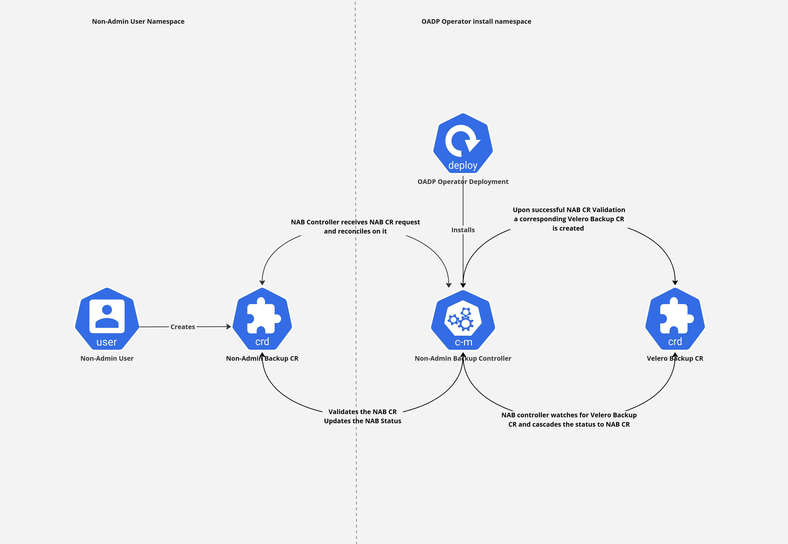
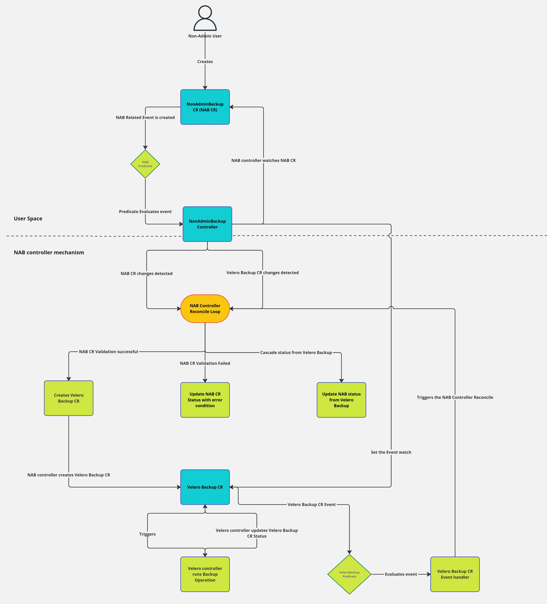

# Non-Admin Backup/Restore Design

## Background
[OADP (Openshift API for Data Protection)](https://github.com/openshift/oadp-operator) Operator currently requires cluster admin access for performing Backup and Restore operations of applications deployed on the OpenShift platform.
This design intends to enable non-admin users the ability to perform Backup and Restore operations of their application namespace.

## Goals
- Enable non-admin backup operation
- Enable non-admin restore operation

## Non-Goals
- Performance improvements of Backup and Restore Operations
- Parallel Backup and Restore Operations

## Use-Cases

### Backup Operation
- As a non-admin user/namespace owner with administrative privileges for a particular namespace, the user should be able to:
    - Create a Backup of the namespace
    - View the status of the Backup created for the particular namespace
    - Delete the Backup of the namespace

### Restore Operation
- As a non-admin user/namespace owner with administrative privileges for a particular namespace, the user should be able to:
    - Create a Restore of the namespace
    - View the status of the Restore created for the particular namespace
    - Delete the Restore of the namespace

### BackupStorageLocation (BSL) Configuration Operation (optional use case)
- As a non-admin user/namespace owner with administrative privileges for a particular namespace, the user should be able to:
    - Create their own BSLs
    - View the status of the BSLs created by them
    - Delete the BSLs created by them
    - Use their own BSLs for Backup/Restore Operations

## Installation
- The Non-Admin Controller (NAC) will be installed via OADP Operator.
- The Data Protection Application (DPA) CR will consist of a root level struct called `nonAdmin` under the features. This struct will have a boolean to `enable` or `disable` the non-admin feature.
- If the `features.nonAdmin.enable` flag is set to `true`, the OADP Operator will install the NAC in OADP Operator's install namespace, by default this feature will be disabled.
- Only one NAC can be installed in the whole cluster. OADP Operator validates this.


## Pre-requisites
- **OADP installed**: OADP Operator must be installed and configured to use non-admin controller
- **RBAC privileges for the user**: User must have the appropriate RBAC privileges to create Non Admin objects within the Namespace where Backup will be taken. An example of such ClusterRole, which may be added to the user with `RoleBinding`:
    ```yaml
    # permissions for end users to edit non-admin custom resources.
    apiVersion: rbac.authorization.k8s.io/v1
    kind: ClusterRole
    metadata:
    labels:
        app.kubernetes.io/name: clusterrole
        app.kubernetes.io/instance: nonadminbackup-editor-role
        app.kubernetes.io/component: rbac
        app.kubernetes.io/created-by: oadp-nac
        app.kubernetes.io/part-of: oadp-nac
        app.kubernetes.io/managed-by: kustomize
    name: nonadminbackup-editor-role
    rules:
    - apiGroups:
        - nac.oadp.openshift.io
      resources:
        - nonadminbackups
        - nonadminrestores
        - nonadminbackupstorageloations
      verbs:
        - create
        - delete
        - get
        - list
        - patch
        - update
        - watch
    - apiGroups:
        - nac.oadp.openshift.io
      resources:
        - nonadminbackups/status
        - nonadminrestores/status
        - nonadminbackupstoragelocations/status
      verbs:
        - get

    ```
    **Note:** If users have admin level access/rights to particular namespace then we do not need to specify the privileges listed above.
- **Existence of Namespace:** The existence of namespace prior to performing non-admin backup/restore operations is a must.(for backup it will obviously exist but for restore it is an explicit hard precondition)
## High-Level design

### Components
- **OADP Operator:** OADP is the OpenShift API for Data Protection operator. This open source operator sets up and installs Velero on the OpenShift platform, allowing users to backup and restore applications.
- **Controllers:** The Non-Admin controller will pack the following controllers as part of it:
    - **Non-Admin Backup (NAB) Controller:** The responsibilities of the NAB controller are:
        - Listen to requests pertaining to Non-Admin Backup CRD
        - Process requests pertaining to Non-Admin Backup CRD
        - Update Non-Admin Backup CR status with the status/events from Velero Backup CR
        - Cascade Any actions performed on Non-Admin Backup CR to corresponding Velero backup CR
    - **Non-Admin Restore (NAR) Controller:** The responsibilities of the NAR controller are:
        - Listen to requests pertaining to Non-Admin Restore CRD
        - Process requests pertaining to Non-Admin Restore CRD
        - Update Non-Admin Backup CR status with the status/events from Velero Restore CR
        - Cascade Any actions performed on Non-Admin Restore CR to corresponding Velero restore CR
    - **Non-Admin BackupStorageLocation (NABSL) controller:** The responsibilities of the NABSL controller are:
        - Listen to requests pertaining to Non-Admin BSL CRD
        - Process requests pertaining to Non-Admin BSL CRD
        - The NABSL controller would cascade the BSL request to Velero controller
        - Validate that the NABSL CR is appropriate and relevant secrets from non-admin user are also obtained (note that authenticating the access keys will not be the NABSL controller's responsibility)
        - The NABSL request can be create/update/view/delete BSL type requests
        - NABSL controller would be responsible for gathering the status from Velero BSL and updating the status of NABSL CR, keeping them in sync
        - Every BSL needs user access keys and storage credentials, NABSL controller will be responsible for provisioning them in Velero NS, once they are provided by the non-admin user.
    - **Non-Admin Backup Sync controller:** The responsibilities of this controller are:
        - Check if the non-admin users NS exists (from the configured ones to watch)
        - Now if this NS exists check if there are any Velero backups that are relevant to this NS
        - Now check if the relevant Velero Backup's Non-Admin backup instances exist in this NS and sync via recreating them if they do not exist.
        - This sync should be done regularly and this sync frequency should be configurable, default can be 30m.
- CRDs: The following CRDs will be provided to Non-Admin users:
    - **Non-Admin Backup (NAB) CRD:** This CRD will encapsulate the whole Velero Backup CRD and some additional spec fields that will be needed for non-admin feature.
    - **Non-Admin Restore (NAR) CRD:** This CRD will encapsulate the whole Velero Restore CRD and some additional spec fields that will be needed for non-admin feature.
    - **Non-Admin BackupStorageLocation (NABSL) CRD:** This CRD will encapsulate the whole Velero BSL CRD and some additional spec fields that will be needed for non-admin feature.


### Implementation details
#### Backup Workflow
- **Non-Admin user creates a Non-Admin backup CR:** The user creates a NonAdminBackup custom resource object in the Namespace on which the backup will run within the Kubernetes cluster. The `NonAdminBackup` schema has the `backupSpec`, which is the same as `Backup` CR from the `velero.io/v1` apiVersion.

    ```yaml
    apiVersion: nac.oadp.openshift.io/v1alpha1
    kind: NonAdminBackup
    metadata:
      name: example
      namespace: user-namespace
    spec:
      backupSpec: {}
    ```
    - **NAB controller reconciles on this NAB CR:** The NonAdminBackup controller continuously reconciles the NonAdminBackup object's desired state with the actual state in the cluster.
    - **NAB controller validates the NAB CR and then creates a corresponding Velero Backup CR:** When the NonAdminBackup controller detects a new or modified NonAdminBackup object, it creates or updates a corresponding Velero Backup object within the OADP Namespace using the information provided in the `backupSpec` field of the NonAdminBackup object. The resulting Backup object is named as `<namespace>-<name>-<hash>`, where the `<namespace>` is the NonAdminBackup namespace, `<name>` is the NonAdminBackup name and the `<hash>` is the generated UUID (version 4). If the resulting Backup object name is too long the name is adapted to 63 characters limit stripping first characters from name and then from namespace. The resulting Backup object is labeled and annotated with the following additional metadata:

    ```yaml
    metadata:
      annotations:
        openshift.io/oadp-nab-origin-name: <NonAdminBackup name>
        openshift.io/oadp-nab-origin-namespace: <NonAdminBackup Namespace>
      labels:
        app.kubernetes.io/managed-by: <OADP NonAdminController id>
        openshift.io/oadp: 'True'
        openshift.io/oadp-nab-origin-nameuuid: <NonAdminBackup's NameUUID from Status>
    ```
    - **Velero runs Backup**: Velero executes the backup operation based on the configuration specified in the Velero Backup object. Velero updates the status of the Velero Backup object to reflect the outcome of the backup process.
    - **Reconcile loop updates NonAdminBackup object Status**: Upon detecting changes in the status of the Velero Backup object, the NonAdminBackup controller's reconciliation loop updates the Status field of the corresponding NonAdminBackup object with the updated status from the Velero Backup object.




#### Restore Workflow
- **Namespace exists:** Hard precondition that the NS exists and non-admin user has the appropriate access
- **Backup Sync controller syncs the Non-admin Backup CRs:** The Backup-Sync controller ensures that the NS relevant backups are synced and Non-admin backup CRs exists for non-admin users to refer them for restore operations.
- **Non-Admin user creates the Non-Admin restore CR:** The user creates NonAdminRestore custom resource object in the Namespace on which the restore will run within the Kubernetes cluster. The `NonAdminRestore` schema has the `restoreSpec`, which is the same as `Restore` CR from the `velero.io/v1` apiVersion. Note that the non-admin user will use non-admin backup name (and not Velero backup name) in non-admin restore spec.
- **NAR controller reconciles on this NAR CR:** The NonAdminRestore controller continuously reconciles the NonAdminRestore object's desired state with the actual state in the cluster.
- **NAR controller validates the NAR CR and then creates a corresponding Velero Restore CR:** When the NonAdminRestore controller detects a new or modified NonAdminRestore object, it creates the corresponding Velero Restore object within the OADP Namespace using the information provided in the `restoreSpec` field of the NonAdminRestore object. The resulting Restore object is named as `<namespace>-<name>-<hash>`, where the `<namespace>` is the NonAdminRestore namespace, `<name>` is the NonAdminRestore name and the `<hash>` is the generated UUID (version 4). If the resulting Restore object name is too long the name is adapted to 63 characters limit stripping first characters from name and then from namespace. The resulting Restore object is labeled and annotated with the following additional metadata:

  ```yaml
  metadata:
    annotations:
      openshift.io/oadp-nar-origin-name: <NonAdminRestore name>
      openshift.io/oadp-nar-origin-namespace: <NonAdminRestore Namespace>
    labels:
      app.kubernetes.io/managed-by: <OADP NonAdminController id>
      openshift.io/oadp: 'True'
      openshift.io/oadp-nar-origin-nameuuid: <NonAdminRestore's NameUUID from Status>
  ```
- **Velero runs Restore**: Velero executes the restore operation based on the configuration specified in the Velero Restore object. Velero updates the status of the Velero Restore object to reflect the outcome of the restore process.
- **Reconcile loop updates NonAdminRestore object Status**: Upon detecting changes in the status of the Velero Restore object, the NonAdminRestore controller's reconciliation loop updates the Status field of the corresponding NonAdminRestore object with the updated status from the Velero Restore object.

- // TODO: Diagram remaining

#### Queuing mechanism on NAB/NAR CR status
  - We will introduce a Queue status on NAB/NAR CR status in order to give some transparency on what is the current backup/restore request status or a general idea when it will get processed so that the non-admin users are not left to wonder about what's happening with their backup/restore.
  - The queuing status would be added to the NAB/NAR CR status, and it would give a general idea about how many backup/restore request are still remaining to be processed before their own backup/restore operation gets triggered.
  - For example, in a singular OADP:NAC environment, lets say there are 5 non-admin users sharing this single OADP/NAC/Velero instance and all of them triggered backups.
    - Current Velero Backup statuses in this example are: Backup-1, Backup-2: Complete; Backup-3: InProgress; Backup-4, Backup-5: New
    - Then Non-Admin Backup Status for Backup-1 and Backup-2 will have `QueuedStatus: Completed`
    - Non-Admin Backup Status for Backup-3 will have `QueuedStatus: Processing`
    - Non-Admin Backup Status for Backup-4 will have `QueuedStatus: 1 Processing`
    - Non-Admin Backup Status for Backup-5 will have `QueuedStatus: 1 Processing, 1 New` Or `QueuedStatus: 2 Backups remaining`
// TODO: Diagram remaining

#### Validating Webhooks to Ensure more transparency and debug-ability
Currently, the velero CLI is a very useful tool, particularly the describe backup option. This option comes in pretty handy to gain more detailed insights on what is getting backed up (ResourceList) or which operations are in progress (async datamover operations) or details like how many items are still remaining to be backed up and much more.
We will be ensuring that non-admin users have view/read access to the Velero CRs that are only relevant to them or created by them.

// TODO: Diagram remaining

#### Control over the Velero spec exposed via Non-Admin CRs
The Velero Backup/BSL/Restore CRs consists of a plethora of Backup Spec options. It might be desirable to have a control over the spec that is exposed or may be allowed listed for non-admin users.
For instance, Backup Spec IncludedNamespaces should by default be the non-admin user's namespace as this is a scoped backup operation
Another instance is mentioned in the relevant discussion of cluster admins wanting to set a default backup TTL for all the non-admin users
Or maybe the cluster-admins want to enforce that only fs-backups should be used for volumes, so defaultVolumesToFSBackup should be true for all non-admin backups.
In order to implement this we could accept a configmap from cluster-admin users in OADP install NS and this configmap would be used to perform run-time validations against the Non-Admin CR instances.

// TODO: Approach Discussion

## Open Questions and Know Limitations
- Velero command and pod logs
- Multiple instances of NAC not allowed (which can impact performance)
- Should BSL configuration be optional like cluster-admin could opt for shard BSLs or BYOB (Bring your own Bucket/BSL)
