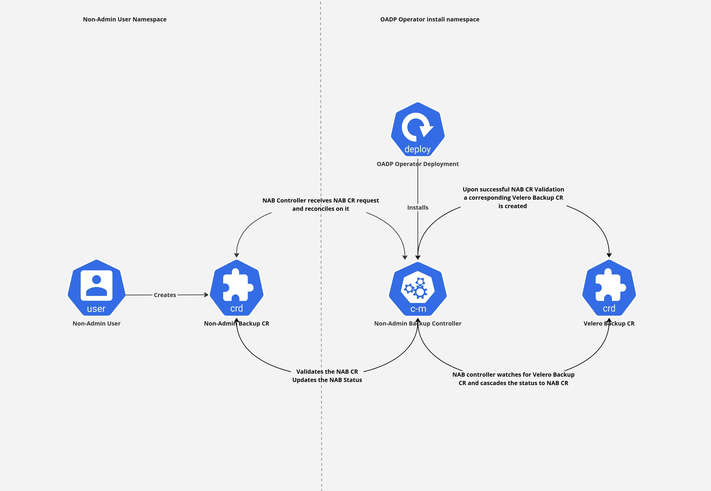
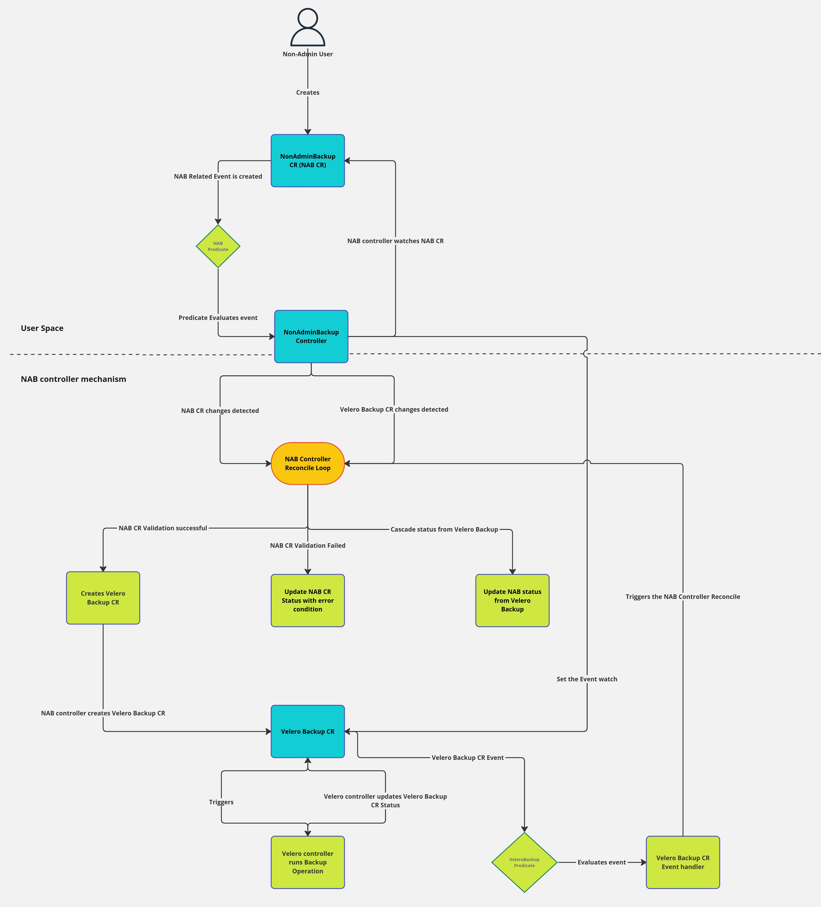

# Non-Admin Backup/Restore Design

## Background
OADP (Openshift API for Data Protection) Operator currently requires cluster admin access for performing Backup and Restore operations of applications deployed on the OpenShift platform. This design intends to enable the ability to perform Backup and Restore operations of their own application namespace for namespace owners aka non-admin users.

## Goals
- Enable non-admin backup operation
- Enable non-admin restore operation

## Non-Goals
- Performance improvements of Backup and Restore Operations
- Parallel Backup and Restore Operations

## Use-Cases

### Backup Operation
- As a non-admin user/namespace owner with administrative priviledges for a particular namespace, the user should be able to:
    - Create a Backup/Schedule of the namespace
    - Update the Backup/Schedule spec of the namespace
    - View the status of the Backup/Schedule created for the particular namespace
    - Delete the Backup/Schedule of the namespace

### Restore Operation
- As a non-admin user/namespace owner with administrative priviledges for a particular namespace, the user should be able to:
    - Create a Restore of the namespace
    - Update the Restore spec of the namespace
    - View the status of the Restore created for the particular namespace
    - Delete the Restore of the namespace


## Installation

- The Non-Admin Controller (NAC) will be installed via OADP Operator. 
- The Data Protection Application (DPA) CR will consist of a root level spec flag called `enableNonAdmin`
- If the `enableNonAdmin` flag is set to `true`, the OADP Operator will install the NAC in OADP Operator's install namespace, the default value for `enableNonAdmin` will be `false` 

## Pre-requisites
- **OADP installed**: OADP must be installed and configured to use non-admin controller
-  **Non Admin Controller configured**: Data Protection Application (DPA) instance must configure Non Admin Controller to watch user namespace(s), by default it watches all Namespaces
- **RBAC priviledges for the user**: User must have the appropriate RBAC priviledges to create Non Admin Backup object within the Namespace where Backup will be taken. An example of such ClusterRole, which may be added to the user with `RoleBinding`:
    ```yaml
    # permissions for end users to edit nonadminbackups.
    apiVersion: rbac.authorization.k8s.io/v1
    kind: ClusterRole
    metadata:
    labels:
        app.kubernetes.io/name: clusterrole
        app.kubernetes.io/instance: nonadminbackup-editor-role
        app.kubernetes.io/component: rbac
        app.kubernetes.io/created-by: oadp-nac
        app.kubernetes.io/part-of: oadp-nac
        app.kubernetes.io/managed-by: kustomize
    name: nonadminbackup-editor-role
    rules:
    - apiGroups:
        - nac.oadp.openshift.io
      resources:
        - nonadminbackups
      verbs:
        - create
        - delete
        - get
        - list
        - patch
        - update
        - watch
    - apiGroups:
        - nac.oadp.openshift.io
      resources:
        - nonadminbackups/status
      verbs:
        - get

    ```

## High-Level design

### Components
- OADP Operator: OADP is the OpenShift API for Data Protection operator. This open source operator sets up and installs Velero on the OpenShift platform, allowing users to backup and restore applications.
- Controllers: The Non-Admin controller will pack the following controllers as part of it:
    - Non-Admin Backup (NAB) Controller: The responsibilities of the NAB controller are:
        - Validate whether the non-admin user has appropriate administrative namepsace access 
        - Validate Wehther the non-admin user has appropriate access to create/view/update /delete Non-Admin Backup CR
        - Listen to requests pertaining to Non-Admin Backup CRD across all the namespaces 
        - Process requests pertaining to Non-Admin Backup CRD across all the namespaces 
        - Update Non-Admin CR status with the status/events from Velero Backup CR
        - Cascade Any actions performed on Non-Admin Backup CR to corresponding Velero backup CR
    - Non-Admin Restore (NAR) Controller
- CRDs: The following CRDs will be provided to Non-Admin users:
    - Non-Admin Backup (NAB) CRD: This iCRD will encapsulate the whole Velero Backup CRD and some additional spec felds that will be needed for non-admin feature.
    - Non-Admin Restore (NAR) CRD

**Note:** Currently, this design considers that the responsibility of the BackupStorageLocation configuration is that of the cluster admin and not non-admin/namespace admin. Hence, no introduction of non-admin BSL controllers and CRDs.  

### Implementation details
- Backup Workflow
    - **Non-Admin user creates/updates a Non-Admin backup CR:**
1. **User creates or updates the NonAdminBackup object**: The user creates or updates a NonAdminBackup custom resource object in the Namespace on which the backup will run within the Kubernetes cluster. The `NonAdminBackup` schema has the `backupSpec`, which is the same as `Backup` CR from the `velero.io/v1` apiVersion.

    ```yaml
    apiVersion: nac.oadp.openshift.io/v1alpha1
    kind: NonAdminBackup
    metadata:
      name: example
      namespace: user-namespace
    spec:
      backupSpec: {}
    ``` 
    - **NAB controller reconiles on this NAB CR:** The NonAdminBackup controller continuously reconciles the NonAdminBackup object's desired state with the actual state in the cluster.
    - **NAB controller validates the NAB CR and then creates a corresponding Velero Backup CR:** When the NonAdminBackup controller detects a new or modified NonAdminBackup object, it creates or updates a corresponding Velero Backup object within the OADP Namespace using the information provided in the `backupSpec` field of the NonAdminBackup object. The resulting Backup object is named as `nab-<namespace>-<hash>`, where the `<namespace>` is the NonAdminBackup namespace and the `<hash>` is computed from the original NonAdminBackup name. The resulting Backup object is labeled and annotated with the following additional metadata:

    ```yaml
    metadata:
      annotations:
        openshift.io/oadp-nab-origin-name: <NonAdminBackup name>
        openshift.io/oadp-nab-origin-namespace: <NonAdminBackup Namespace>
        openshift.io/oadp-nab-origin-uuid: <NonAdminBackup UUID>
      labels:
        app.kubernetes.io/managed-by: <OADP NonAdminController id>
        openshift.io/oadp: 'True'
    ```
    - **Velero runs Backup**: Velero executes the backup operation based on the configuration specified in the Velero Backup object. Velero updates the status of the Velero Backup object to reflect the outcome of the backup process.
    - **Velero runs Backup**: Velero executes the backup operation based on the configuration specified in the Velero Backup object. Velero updates the status of the Velero Backup object to reflect the outcome of the backup process.
    - **Reconcile loop updates NonAdminBackup object Status**: Upon detecting changes in the status of the Velero Backup object, the NonAdminBackup controller's reconciliation loop updates the Status field of the corresponding NonAdminBackup object with the updated status from the Velero Backup object.



- Restore Workflow


## Open Questions and Know Limitations
- Velero command and pod logs
- Multiple instance of OADP Operator