```mermaid
%%{init: {'theme':'neutral'}}%%
flowchart TD
    title[NonAdminBackup Controller Workflow]
    style title font-size:24px,font-weight:bold,fill:#e6f3ff,stroke:#666,stroke-width:2px,stroke-dasharray: 0

    %% Start and Main Switch
    NAB_START[**Start NonAdminBackup Reconciliation**] --> SWITCH[**Switch on Workflow Type**]

    %% Paths with Consistent Labels
    SWITCH -->|**API Create/Update Event**| CREATE_UPDATE[**Process Create/Update**]
    SWITCH -->|**API Delete Event**| NAB_API_DELETE[**Process API Delete**]
    SWITCH -->|**Force Delete Spec: true**| FORCE_DELETE[**Process Force Delete**]
    SWITCH -->|**Delete Spec: true**| DELETE_BACKUP[**Process Delete Request**]

    %% Create/Update Path - Detailed Version
    CREATE_UPDATE --> initNabCreate{NAB Phase Empty?}
    initNabCreate -->|No| validateSpec
    initNabCreate -->|Yes| setNewPhase[NAB Phase: **New**]
    setNewPhase -->|Update Status if Changed<br>▶ Continue ║No Requeue║| validateSpec{Validate BackupSpec<br>in NonAdminBackup}
    validateSpec -->|Invalid| setBackingOffPhase[NAB Phase: **BackingOff**]
    setBackingOffPhase --> setInvalidCondition[NAB Condition:: Accepted=False<br>Reason: InvalidBackupSpec]
    validateSpec -->|Valid| setAcceptedCondition[NAB Condition:: Accepted=True<br>Reason: BackupAccepted]
    setInvalidCondition -->|Update Status if Changed<br>▶ Continue ║No Requeue║| terminalError[Terminal Error]
    setAcceptedCondition -->|Update Status if Changed<br>▶ Continue ║No Requeue║| refetchNAB[Re-fetch NAB]
    refetchNAB --> checkVeleroBackup{Does NAB Status.VeleroBackup<br>contain NACUUID?}
    checkVeleroBackup -->|No| generateNACUUID[Generate NACUUID for VeleroBackup]
    generateNACUUID --> updateNABStatus[Set NAB Status:<br>veleroBackup.nacuuid<br>veleroBackup.namespace<br>veleroBackup.name]
    updateNABStatus --> |Update Status if Changed<br>▶ Continue ║No Requeue║| setFinalizer{NAB has Finalizer?}
    checkVeleroBackup -->|Yes| setFinalizer
    setFinalizer -->|No| addFinalizer[Add Finalizer to NAB]
    addFinalizer -->|NAB Object Update<br>↻ Reconcile ║API Event║<br>▶ Continue ║No Requeue║| createVB
    setFinalizer -->|Yes| createVB{VeleroBackup Exists?}
    createVB -->|No| createNewVB[Create VeleroBackup]
    createNewVB  --> setCreatedPhase[NAB Phase: **Created**]
    setCreatedPhase --> setQueuedCondition[NAB Condition:: Queued=True<br>Reason: BackupScheduled<br>Message: Created Velero Backup object]
    createVB -->|Yes| updateFromVB[Update NAB Status from VeleroBackup:<br>Phase, Start Time, Completion Time,<br>Expiration, Errors, Warnings,<br>Progress, ValidationErrors<br>Queue Info: estimatedQueuePosition]
    setQueuedCondition -->|Update Status if Changed<br>▶ Continue ║No Requeue║| endCreateUpdate[End Create/Update]
    updateFromVB -->|Update Status if Changed<br>▶ Continue ║No Requeue║| endCreateUpdate


    %% API Delete Path
    NAB_API_DELETE --> setPhase["NAB Phase: **Deleting**"]
    setPhase --> setCondition["NAB Condition: Deleting=True
    Reason: DeletionPending
    Message: backup deletion requires setting
    spec.deleteBackup or spec.forceDeleteBackup
    to true or finalizer removal"]
    setCondition -->|Update Status if Changed<br>▶ Continue ║No Requeue║| endDelete["End"]

    %% Force Delete Path
    FORCE_DELETE --> setDeletingPhase[NAB Phase: **Deleting**]
    setDeletingPhase --> setDeletingCondition[NAB Condition:: Deleting=True<br>Reason: DeletionPending<br>Message: backup accepted for deletion]
    setDeletingCondition --> checkStatusChanged{NAB Status<br>requires update?}
    checkStatusChanged -->|No| checkDeletionTimestamp{NAB DeletionTimestamp<br>Is Zero?}
    checkStatusChanged -->|Yes| updateAndRequeue[Update NAB Status<br>║↻ Set To Requeue║]
    updateAndRequeue --> checkDeletionTimestamp
    checkDeletionTimestamp -->|No| checkRequeueFlag
    checkDeletionTimestamp -->|Yes| initiateForceDelete[Set Delete on NAB Object]
    initiateForceDelete --> requeueAfterForceDelete[║↻ Set To Requeue]
    checkVeleroObjects -->|Don't Exist| removeFinalizer
    requeueAfterForceDelete --> checkRequeueFlag{Is Set <br>To Requeue?}
    checkRequeueFlag --> |No| checkVeleroObjects
    checkRequeueFlag --> |Yes| requeueForceDeletePath[║↻ Requeue║]
    checkVeleroObjects{Check VeleroBackup<br> or DeleteBackupRequest} -->|Exist| deleteVeleroObjects[Delete VeleroBackup and<br>DeleteBackupRequest Objects]
    deleteVeleroObjects --> removeFinalizer[Remove NAB Finalizer]
    removeFinalizer --> endForce[End Force Delete]

    %% Delete Backup Path
    DELETE_BACKUP --> setDeletingPhaseDelete[NAB Phase: **Deleting**]
    setDeletingPhaseDelete --> setDeletingConditionDelete[NAB Condition:: Deleting=True<br>Reason: DeletionPending<br>Message: backup accepted for deletion]
    setDeletingConditionDelete --> checkStatusChangedDelete{NAB Status<br>requires update?}
    checkStatusChangedDelete -->|No| checkDeletionTimestampDelete{NAB DeletionTimestamp<br>Is Zero?}
    checkStatusChangedDelete -->|Yes| updateAndRequeueDelete[Update NAB Status<br>║↻ Set To Requeue║]
    updateAndRequeueDelete --> checkDeletionTimestampDelete
    checkDeletionTimestampDelete -->|No| checkRequeueFlagDelete
    checkDeletionTimestampDelete -->|Yes| initiateDelete[Set Delete on NAB Object]
    initiateDelete --> requeueAfterDelete[║↻ Set To Requeue]
    requeueAfterDelete --> checkRequeueFlagDelete{Is Set <br>To Requeue?}
    checkRequeueFlagDelete --> |No| checkFinalizer{NAB has<br>Finalizer?}
    checkRequeueFlagDelete --> |Yes| requeueDeletePath[║↻ Requeue║]
    checkFinalizer -->|No| endDeleteBackup[End Delete Backup]
    checkFinalizer -->|Yes| checkVeleroBackupInfo{Check VeleroBackup}
    checkVeleroBackupInfo -->|Don't Exist| removeNABFinalizer[Remove NAB Finalizer]
    checkVeleroBackupInfo -->|Exists| checkDeleteBackupRequest{Check DeleteBackupRequest}
    checkDeleteBackupRequest -->|Don't Exists| createDeleteBackupRequest[Create DeleteBackupRequest]
    checkDeleteBackupRequest -->|Exists| updateDBRStatus[Update NAB Status from<br>DeleteBackupRequest Info]
    createDeleteBackupRequest --> updateDBRStatus[Update NAB Status from<br>DeleteBackupRequest Info]
    updateDBRStatus --> |Update Status if Changed<br>▶ Continue ║No Requeue║| waitForVBDeletion{Check if VeleroBackup<br>still exists?}
    waitForVBDeletion -->|No| removeNABFinalizer[Remove NAB Finalizer]
    waitForVBDeletion -->|Yes| requeueForVBDeletion[║↻ Requeue║]
    removeNABFinalizer --> endDeleteBackup

    %% Apply additional styles
    class checkFinalizer,checkVeleroBackupInfo,waitForVBDeletion decision
    class createDeleteBackupRequest,removeNABFinalizer process
    class updateDBRStatus update
    class endDeleteBackup endpoint

    %% Styling
    classDef decision fill:#ffeb99,stroke:#333,stroke-width:2px
    classDef process fill:#b3d9ff,stroke:#333,stroke-width:2px
    classDef endpoint fill:#d9f2d9,stroke:#333,stroke-width:2px
    classDef update fill:#ff9999,stroke:#333,stroke-width:2px
    classDef refetch fill:#99ccff,stroke:#333,stroke-width:2px
    classDef phase fill:#ffb366,stroke:#333,stroke-width:2px
    classDef condition fill:#99ff99,stroke:#333,stroke-width:2px
    classDef statusCheck fill:#ff99cc,stroke:#333,stroke-width:2px
    classDef deleteProcess fill:#ffcccc,stroke:#333,stroke-width:2px
    classDef waitState fill:#ccccff,stroke:#333,stroke-width:2px

    %% Apply styles to all nodes
    class SWITCH,initNabCreate,validateSpec,setFinalizer,createVB,checkVeleroBackup,validateDelete,checkDeletionTimestamp,checkDeletionTimestampDelete,checkRequeueFlagDelete,checkVeleroObjects,checkRequeueFlag,checkStatusChanged,checkStatusChangedDelete,checkDeleteBackupRequest decision
    class start,CREATE_UPDATE,NAB_API_DELETE,FORCE_DELETE,DELETE_BACKUP,generateNACUUID,createNewVB,removeBackup,initiateForceDelete,deleteVeleroObjects,initiateDelete process
    class terminalError,endCreateUpdate,endDelete,endForce,endDeleteBackup endpoint
    class setNewPhase,setBackingOffPhase,setCreatedPhase,setPhase,setDeletePhase,setDeletionPhase,setDeletingPhase,setDeletingPhaseDelete phase
    class setInitialCondition,setInvalidCondition,setAcceptedCondition,setQueuedCondition,setCondition,setDeletingCondition,setDeletingConditionDelete condition
    class updateFromVB,updateNABStatus,addFinalizer,removeFinalizer update
    class refetchNAB refetch
    class setDeleteStatus,createDBR,updateStatus deleteProcess
    class waitForDeletion waitState

```

# Controller Workflow: NonAdminBackup and NonAdminRestore Status Update

## Overview

This document outlines the design around updating NonAdminBackup (NAB) and NonAdminRestore (NAR) objects' Statuses.

## NonAdminBackup and NonAdminRestore Status

The `status` field of NAB and NAR objects contains the following fields, which are updated by NAB and NAR controllers:
- `phase`
- `conditions`
- `veleroBackup` for NAB and `veleroRestore` for NAR, which contains name, namespace and status of the related Velero object.
- `queueInfo` contains estimatedQueuePosition, which is best effort estimation of the position of the NAB/NAR in the Velero queue.

Any reconciliation function that depends on data stored in the `status` field must ensure it operates on the most recent version of that field from the cluster before proceeding.

### Phase

The `phase` field is a simple one high-level summary of the lifecycle of the objects, that only moves forward. Once a `phase` changes, it can not return to the previous value.

It is always a one well defined value, that is intended to be a comprehensive state of a NAB or NAR object.

Those are are the possible values for phase:

| **Value** | **Description** |
|-----------|-----------------|
| New | *NonAdminBackup/NonAdminRestore* resource was accepted by the NAB/NAR Controller, but it has not yet been validated by the NAB/NAR Controller |
| BackingOff | *NonAdminBackup/NonAdminRestore* resource was invalidated by the NAB/NAR Controller, due to invalid Spec. NAB/NAR Controller will not reconcile the object further, until user updates it |
| Created | *NonAdminBackup/NonAdminRestore* resource was validated by the NAB/NAR Controller and Velero *Backup/restore* was created. The Phase will not have additional information about the *Backup/Restore* run |
| Deletion | *NonAdminBackup/NonAdminRestore* resource has been marked for deletion. The NAB/NAR Controller will delete the corresponding Velero *Backup/Restore* if it exists. Once this deletion completes, the *NonAdminBackup/NonAdminRestore* object itself will also be removed |

### Conditions

The `conditions` field is a list of conditions.
One NAB/NAR object may have multiple conditions.
It is more granular knowledge of the NAB/NAR object and represents the array of the conditions through which the object has or has not passed.

Each `condition` data is composed by the following:

| **Field name** | **Description** |
|----------------|-----------------|
| type | The `NonAdminCondition` of the condition |
| status | represents the state of individual condition. One of `True`, `False` or `Unknown`. |
| lastTransitionTime | Timestamp for when this condition was created/updated. |
| reason | Machine-readable, UpperCamelCase text indicating details about the last status transition. |
| message | Human-readable message indicating details about the last status transition. |

Those are are the possible values for `NonAdminCondition`:

| **Value** | **Description** |
|-----------|-----------------|
| Accepted | The NonAdminBackup/NonAdminRestore object was accepted by the controller, but the Velero Backup/Restore may have not yet been created |
| Queued | The Velero Backup/Restore was created successfully. At this stage errors may still occur either from the Velero not accepting object or during backup/restore procedure. |
| Deleting | The NonAdminBackup object is pending deletion, but the Velero Backup object is still present. The NAB Controller will not reconcile the object further, until the Velero Backup object is deleted. |

### Velero object reference

NonAdminBackup/NonAdminRestore `status` contains reference to the related Velero Backup/Restore.

NonAdminBackup `status.veleroBackup` contains `nacuuid`, `namespace` and `status`.
- `status.veleroBackup.nacuuid` field stores generated unique UUID of the `VeleroBackup` object. The same UUID is also stored as the label value `openshift.io/oadp-nab-origin-nacuuid` within the created `VeleroBackup` object.
- `status.veleroBackup.namespace` represents the namespace in which the `VeleroBackup` object was created.
- `status.veleroBackup.status` field is a copy of the `VeleroBackup` object status.

The format of those fields allows to interact with that Backup using `oc` or `velero` commands as follows:

```yaml
status:
  veleroBackup:
    name: nab-nacproject-c3499c2729730a
    namespace: openshift-adp
    status:
     ...
```

```shell
velero backup describe -n openshift-adp nab-nacproject-c3499c2729730a
```

Similarly, NonAdminRestore `status.veleroRestore` contains `nacuuid`, `namespace` and `status`.
- `status.veleroRestore.nacuuid` field stores generated unique UUID of the `VeleroRestore` object. The same UUID is also stored as the label value `openshift.io/oadp-nar-origin-nacuuid` within the created `VeleroRestore` object.
- `status.veleroRestore.namespace` represents the namespace in which the `veleroRestore` object was created.
- `status.veleroRestore.status` field is a copy of the `VeleroRestore` object status.

## Example

Sample status field of a NonAdminBackup object.
It is similar for a NonAdminRestore.

Object passed validation and Velero `Backup` object was created, but there was an error while performing backup operation:

```yaml
status:
  veleroBackup:
    nacuuid: nonadmin-test-86b8d92b-66b2-11e4-8a2d-42010af06f3f
    namespace: openshift-adp
    status:
      expiration: '2024-05-16T08:12:11Z'
      failureReason: >-
        unable to get credentials: unable to get key for secret: Secret
        "cloud-credentials" not found
      formatVersion: 1.1.0
      phase: Failed
      startTimestamp: '2024-04-16T08:12:11Z'
      version: 1
  conditions:
    - lastTransitionTime: '2024-04-15T20:27:35Z'
      message: NonAdminBackup object was validated
      reason: NonAdminBackupAccepted
      status: 'True'
      type: Accepted
    - lastTransitionTime: '2024-04-15T20:27:45Z'
      message: Created Velero Backup object
      reason: BackupScheduled
      status: 'True'
      type: Queued
  phase: Created
```

### Queue Info

`queueInfo` contains `estimatedQueuePosition`, which represents the number of other Velero backups that need to be processed by Velero before the current NonAdminBackup (NAB) or NonAdminRestore (NAR) is handled. This estimate is accurate when the Velero pod is running continuously. However, it may become very inaccurate if the Velero pod was restarted or started after the Velero backups already existed in the cluster.
In the future the queueInfo may be extended with more fields to provide more information about the Velero queue such as time or size of the backups in the queue.

```yaml
status:
  conditions:
    - lastTransitionTime: '2024-11-25T18:34:01Z'
      message: backup accepted
      reason: BackupAccepted
      status: 'True'
      type: Accepted
    - lastTransitionTime: '2024-11-25T18:34:01Z'
      message: Created Velero Backup object
      reason: BackupScheduled
      status: 'True'
      type: Queued
  phase: Created
  queueInfo:
    estimatedQueuePosition: 12
  veleroBackup:
    nacuuid: mongo-persistent-anotherte-0d0b7b2c-ee76-412d-a867-2c23b8aa51ab
    name: mongo-persistent-anotherte-0d0b7b2c-ee76-412d-a867-2c23b8aa51ab
    namespace: openshift-adp
    status: {}
```

When the Backup is InProgress, the status will be updated with the `estimatedQueuePosition` being set to 1 and the `veleroBackup` phase being set to InProgress.

```yaml
status:
  conditions:
    - lastTransitionTime: '2024-11-27T10:47:49Z'
      message: backup accepted
      reason: BackupAccepted
      status: 'True'
      type: Accepted
    - lastTransitionTime: '2024-11-27T10:47:50Z'
      message: Created Velero Backup object
      reason: BackupScheduled
      status: 'True'
      type: Queued
  phase: Created
  queueInfo:
    estimatedQueuePosition: 1
  veleroBackup:
    nacuuid: mongo-persistent-c95bc62d-f40c-47b8-8a28-0dd7addb4930
    name: mongo-persistent-anotherte-c95bc62d-f40c-47b8-8a28-0dd7addb4930
    namespace: openshift-adp
    status:
      expiration: '2024-12-27T10:48:45Z'
      formatVersion: 1.1.0
      phase: InProgress
      startTimestamp: '2024-11-27T10:48:45Z'
      version: 1
```
After the Backup is successfull, the `veleroBackup` phase will be set to Completed with additional information about the backup and the `estimatedQueuePosition` will be set to 0.

```yaml
status:
  conditions:
    - lastTransitionTime: '2024-11-27T10:47:49Z'
      message: backup accepted
      reason: BackupAccepted
      status: 'True'
      type: Accepted
    - lastTransitionTime: '2024-11-27T10:47:50Z'
      message: Created Velero Backup object
      reason: BackupScheduled
      status: 'True'
      type: Queued
  phase: Created
  queueInfo:
    estimatedQueuePosition: 0
  veleroBackup:
    nacuuid: mongo-persistent-anotherte-c95bc62d-f40c-47b8-8a28-0dd7addb4930
    name: mongo-persistent-anotherte-c95bc62d-f40c-47b8-8a28-0dd7addb4930
    namespace: openshift-adp
    status:
      completionTimestamp: '2024-11-27T10:48:50Z'
      expiration: '2024-12-27T10:48:45Z'
      formatVersion: 1.1.0
      hookStatus: {}
      phase: Completed
      progress:
        itemsBackedUp: 56
        totalItems: 56
      startTimestamp: '2024-11-27T10:48:45Z'
      version: 1
```


## Status Update scenarios

The following graph shows the lifecycle of a NonAdminBackup.
It is similar for a NonAdminRestore.



