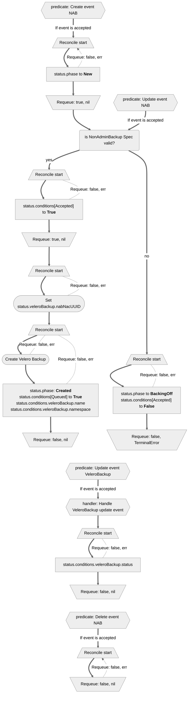

# Controller Workflow: NonAdminBackup and NonAdminRestore Status Update

## Overview

This document outlines the design around updating NonAdminBackup (NAB) and NonAdminRestore (NAR) objects' Statuses.

## NonAdminBackup and NonAdminRestore Status

The `status` field of NAB and NAR objects contains the following fields:
- `phase`
- `conditions`
- `veleroBackup` for NAB and `veleroRestore` for NAR, which contains name, namespace and status of the related Velero object.

which are updated by NAB and NAR controllers.

Only one update call should be performed per reconcile of NAB and NAR objects. Controller can requeue or depend on predicates if more updates are needed in that object.

### Phase

The `phase` field is a simple one high-level summary of the lifecycle of the objects, that only moves forward. Once a `phase` changes, it can not return to the previous value.

It is always a one well defined value, that is intended to be a comprehensive state of a NAB or NAR object.

Those are are the possible values for phase:

| **Value** | **Description** |
|-----------|-----------------|
| New | *NonAdminBackup/NonAdminRestore* resource was accepted by the NAB/NAR Controller, but it has not yet been validated by the NAB/NAR Controller |
| BackingOff | *NonAdminBackup/NonAdminRestore* resource was invalidated by the NAB/NAR Controller, due to invalid Spec. NAB/NAR Controller will not reconcile the object further, until user updates it |
| Created | *NonAdminBackup/NonAdminRestore* resource was validated by the NAB/NAR Controller and Velero *Backup/restore* was created. The Phase will not have additional information about the *Backup/Restore* run |

### Conditions

The `conditions` field is a list of conditions.
One NAB/NAR object may have multiple conditions.
It is more granular knowledge of the NAB/NAR object and represents the array of the conditions through which the object has or has not passed.

Each `condition` data is composed by the following:

| **Field name** | **Description** |
|----------------|-----------------|
| type | The `NonAdminCondition` of the condition |
| status | represents the state of individual condition. One of `True`, `False` or `Unknown`. |
| lastTransitionTime | Timestamp for when this condition was created/updated. |
| reason | Machine-readable, UpperCamelCase text indicating details about the last status transition. |
| message | Human-readable message indicating details about the last status transition. |

Those are are the possible values for `NonAdminCondition`:

| **Value** | **Description** |
|-----------|-----------------|
| Accepted | The NonAdminBackup/NonAdminRestore object was accepted by the controller, but the Velero Backup/Restore may have not yet been created |
| Queued | The Velero Backup/Restore was created successfully. At this stage errors may still occur either from the Velero not accepting object or during backup/restore procedure. |

### Velero object reference

NonAdminBackup/NonAdminRestore `status` contains reference to the related Velero Backup/Restore.

NonAdminBackup `status.veleroBackup` contains `nabnacuuid`, `namespace` and `status`.
- `status.veleroBackup.nabnacuuid` field stores generated unique UUID of the `VeleroBackup` object. The same UUID is also stored as the label value `openshift.io/oadp-nab-origin-uuid` within the created `VeleroBackup` object.
- `status.veleroBackup.namespace` represents the namespace in which the `VeleroBackup` object was created.
- `status.veleroBackup.status` field is a copy of the `VeleroBackup` object status.

The format of those fields allows to interact with that Backup using `oc` or `velero` commands as follows:

```yaml
status:
  veleroBackup:
    name: nab-nacproject-c3499c2729730a
    namespace: openshift-adp
    status:
     ...
```

```shell
velero backup describe -n openshift-adp nab-nacproject-c3499c2729730a
```

Similarly, NonAdminRestore `status.veleroRestore` contains `nabnacuuid`, `namespace` and `status`.
- `status.veleroRestore.nabnacuuid` field stores generated unique UUID of the `VeleroRestore` object. The same UUID is also stored as the label value `openshift.io/oadp-nar-origin-uuid` within the created `VeleroRestore` object.
- `status.veleroRestore.namespace` represents the namespace in which the `veleroRestore` object was created.
- `status.veleroRestore.status` field is a copy of the `VeleroRestore` object status.

## Example

Sample status field of a NonAdminBackup object.
It is similar for a NonAdminRestore.

Object passed validation and Velero `Backup` object was created, but there was an error while performing backup operation:

```yaml
status:
  veleroBackup:
    nabnacuuid: nonadmin-test-86b8d92b-66b2-11e4-8a2d-42010af06f3f
    namespace: openshift-adp
    status:
      expiration: '2024-05-16T08:12:11Z'
      failureReason: >-
        unable to get credentials: unable to get key for secret: Secret
        "cloud-credentials" not found
      formatVersion: 1.1.0
      phase: Failed
      startTimestamp: '2024-04-16T08:12:11Z'
      version: 1
  conditions:
    - lastTransitionTime: '2024-04-15T20:27:35Z'
      message: NonAdminBackup object was validated
      reason: NonAdminBackupAccepted
      status: 'True'
      type: Accepted
    - lastTransitionTime: '2024-04-15T20:27:45Z'
      message: Created Velero Backup object
      reason: BackupScheduled
      status: 'True'
      type: Queued
  phase: Created
```

## Status Update scenarios

The following graph shows the lifecycle of a NonAdminBackup.
It is similar for a NonAdminRestore.


