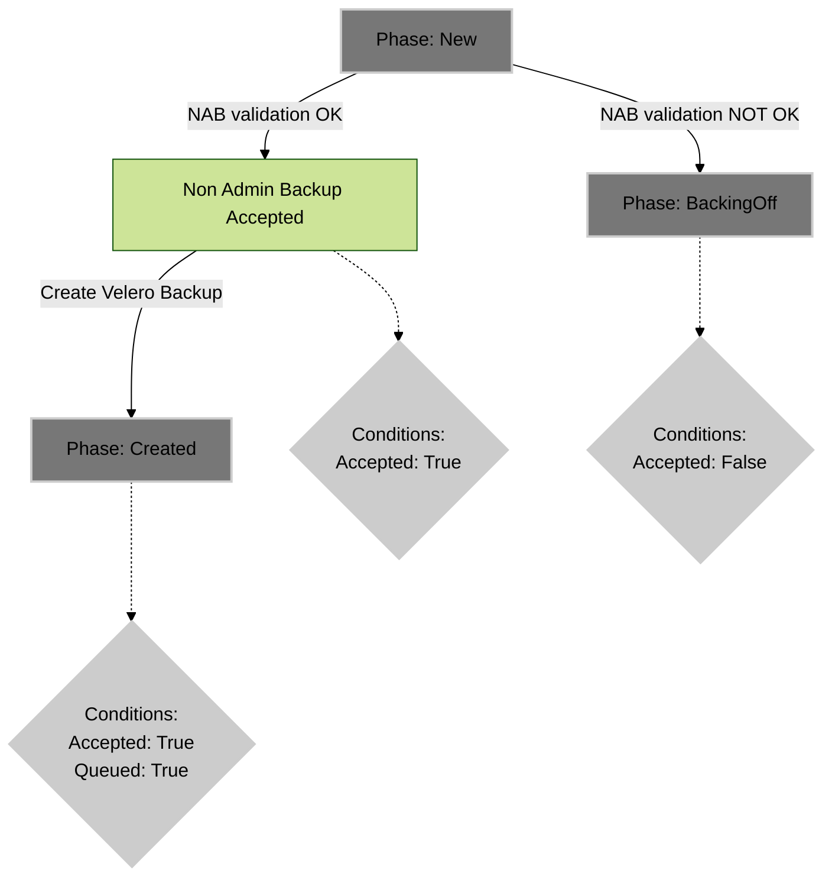

# Developer Workflow: NonAdminBackup and NonAdminRestore Status Update

## Overview

This document outlines the design around updating NonAdminBackup (NAB) and NonAdminRestore (NAR) objects' Status.

## NonAdminBackup and NonAdminRestore Status

The `status` field of NAB and NAR objects contains the following fields:
- `phase`
- `conditions`
- `veleroStatus`
- `veleroObject` TODO

which are updated by NAC controller.

### Phase

The `phase` field is a simple one high-level summary of the lifecycle of the objects.

It is always a one well defined value, that is intended to be a comprehensive state of a NAB or NAR object.

Those are are the possible values for phase:

| **Value** | **Description** |
|-----------|-----------------|
| New | *NonAdminBackup/NonAdminRestore* resource was accepted by the OpenShift cluster, but it has not yet been processed by the NonAdminController |
| BackingOff | Velero *Backup/Restore* object was not created due to *NonAdminBackup/NonAdminRestore* error (configuration or similar) |
| Created | Velero *Backup/restore* was created. The Phase will not have additional information about the *Backup/Restore* run |
| Deleted | TODO |

### Conditions

The `conditions` field is a list of conditions.
One NAB/NAR object may have multiple conditions.
It is more granular knowledge of the NAB/NAR object and represents the array of the conditions through which the object has or has not passed.

Each `condition` data is composed by the following:

| **Field name** | **Description** |
|----------------|-----------------|
| type | The `NonAdminCondition` of the condition |
| status | represents the state of individual condition. The resulting `phase` value should report `Success` only when all of the conditions are met and the backup/restore succeeded. One of `True`, `False` or `Unknown`. |
| lastTransitionTime | Timestamp for when the NonAdminBackup/NonAdminRestore last transitioned from one status to another. |
| reason | Machine-readable, UpperCamelCase text indicating the reason for the condition's last transition. |
| message | Human-readable message indicating details about the last status transition. |

Those are are the possible values for `NonAdminCondition`:

| **Value** | **Description** |
|-----------|-----------------|
| Accepted | The NonAdminBackup/NonAdminRestore object was accepted by the reconcile loop, but the Velero Backup/Restore may have not yet been created |
| Queued | The Velero Backup/Restore was created successfully. At this stage errors may still occur either from the Velero not accepting object or during backup/restore procedure. |

### VeleroStatus

The `VeleroStatus` field is a copy of the Velero `Backup.Status` for NonAdminBackup; and a copy of Velero `Restore.Status` for NonAdminRestore.

### Velero object reference

TODO

The `VeleroBackupName` is a component of the `NonAdminBackup.Status` object. It represents the name of the `VeleroBackup` object. The `VeleroBackupNamespace` represents the namespace in which the `VeleroBackup` object was created.

This `VeleroBackupName` and `VeleroBackupNamespace` serves as a reference to the Backup responsible for executing the backup task.

The format of those fields allows to interact with that Backup using `oc` or `velero` commands as follows:

```yaml
status:
  veleroBackupName: nab-nacproject-c3499c2729730a
  veleroBackupNamespace: openshift-adp
```

```shell
oc describe -n openshift-adp nab-nacproject-c3499c2729730a

velero backup describe -n openshift-adp nab-nacproject-c3499c2729730a
```

## Example

Sample status field of a NonAdminBackup object.
It is similar for a NonAdminRestore.
Object passed validation and allowed to create Velero `Backup` object, but there was an error while performing backup itself:

TODO
```yaml
status:
  veleroBackupStatus:
    expiration: '2024-05-16T08:12:11Z'
    failureReason: >-
      unable to get credentials: unable to get key for secret: Secret
      "cloud-credentials" not found
    formatVersion: 1.1.0
    phase: Failed
    startTimestamp: '2024-04-16T08:12:11Z'
    version: 1
  conditions:
    - lastTransitionTime: '2024-04-15T20:27:35Z'
      message: Backup was accepted by the NAC controller
      reason: BackupAccepted
      status: 'True'
      type: Accepted
    - lastTransitionTime: '2024-04-15T20:27:45Z'
      message: Created Velero Backup object
      reason: BackupScheduled
      status: 'True'
      type: Queued
  veleroBackupName: nab-nacproject-83fc04a2fd253d
  veleroBackupNamespace: openshift-adp
  phase: Created
```

## Phase Update scenarios

The following graph shows the lifecycle of a NonAdminBackup.
It is similar for a NonAdminRestore.


```mermaid
%%{init: {'theme':'forest'}}%%
graph
START[Phase: New] -- NAB validation OK --> ACCEPTED[Non Admin Backup Accepted]
START -- NAB validation NOT OK --> ERROR[Phase: BackingOff]
ACCEPTED -- Create Velero Backup --> CREATED[Phase: Created]
ACCEPTED -.-> COND_ACCEPTED{Conditions:\nAccepted: True\n}
CREATED -.-> COND_QUEUED{Conditions:\nAccepted: True\nQueued: True\n}
ERROR -.-> COND_ERROR{Conditions:\nAccepted: False}

classDef conditions fill:#ccc,stroke:#ccc,stroke-width:2px;
class COND_ACCEPTED,COND_QUEUED,COND_ERROR conditions;
classDef phases fill:#777,stroke:#ccc,stroke-width:2px;
class START,CREATED,ERROR phases;
```
