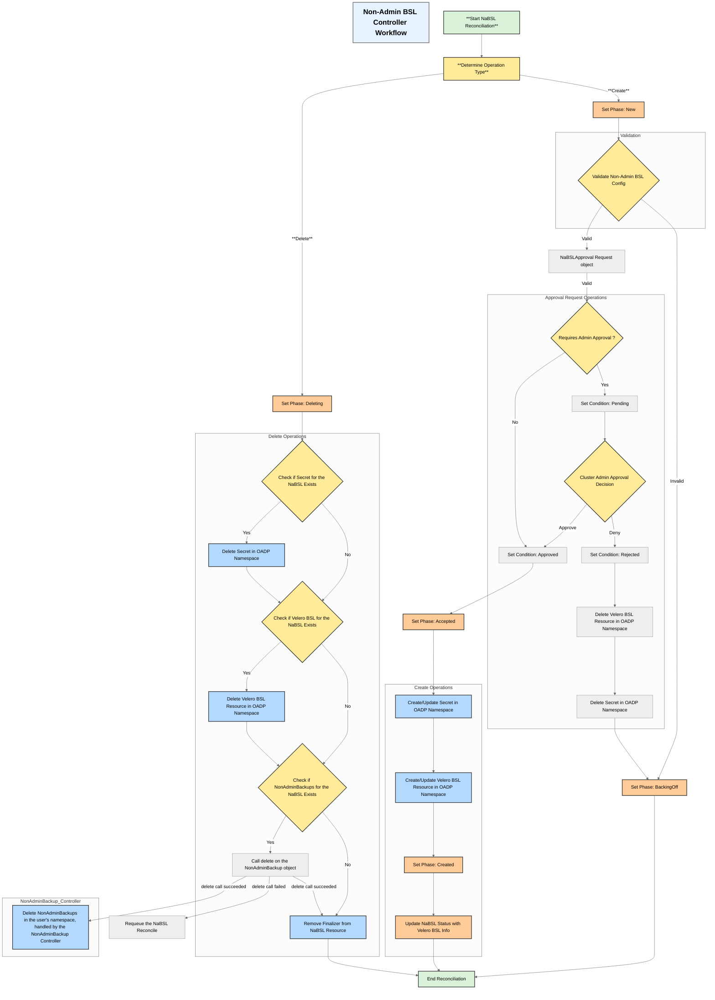

# NonAdminBackupStorageLocation Controller Design

## Overview
The `NonAdminBackupStorageLocation` controller is responsible for managing backup storage locations requested by non-admin users in a multi-tenant Kubernetes environment. It ensures that users can only access and manage backup storage locations within their authorized namespaces while maintaining security boundaries.

## Architecture



## Components

### 1. Controller Structure
- **Name**: NonAdminBackupStorageLocation
- **Type**: Kubernetes Custom Resource Controller
- **Scope**: Namespace-scoped
- **Watch Resources**: BackupStorageLocation CRD, NonAdminBackupStorageLocationRequest CRD, NonAdminBackupStorageLocationRequest CRD

### 2. Key Responsibilities
- Validate user permissions for Non-Admin BSL
- Manage Velero BSL lifecycle (create, update, delete)
- Manage Velero BSL Secret lifecycle (create, update, delete)
- Ensure namespace isolation
- Validate Non-Admin BSL configurations
- Update Non-Admin BSL status
- Generate and store Non-Admin BSL UUID in the NaBSL Status
- Use the UUID to create or update relevant resources
- **Handle NABSL Approvals**: Process `NonAdminBackupStorageLocationRequest` to approve, reject or revoke NonAdminBackupStorageLocation requests.

### 3. Security Considerations
- Prevention of cross-namespace access by ensuring that user can only point to the namespace Secret and the resulting Velero BSL resource will point to the secret in the OADP namespace

## NonAdminBackupStorageLocationRequest

### Purpose
The `NonAdminBackupStorageLocationRequest` is a custom resource that allows non-admin users to request approval for creating or updating a backup storage location. This ensures that all backup storage locations are reviewed and approved by an admin before they are created or modified.

### Structure
- **Name**: NonAdminBackupStorageLocationRequest
- **Type**: Kubernetes Custom Resource
- **Scope**: Namespace-scoped (same namespace as the OADP operator)
- **Fields**:
  - `spec`:
    - `approvalDecision`: allow cluster admin to approve or deny the request. The possible values are `approve`, `reject`, and `pending` (waiting for approval).
  - `status`:
    - `phase`: the phase of the NonAdminBackupStorageLocationRequest. The possible values are `Pending`, `Approved`, and `Rejected`.
    - `veleroBackupStorageLocationRequest`:
      - `requestedSpec`: the requested by the user Velero BSL spec.
      - `nacuuid`: the UUID of the NonAdminBackupStorageLocation.
      - `name`: the name of the NonAdminBackupStorageLocation.
      - `namespace`: the namespace of the NonAdminBackupStorageLocation.

---

### **Notes:**
- Previously approved `NonAdminBackupStorageLocation` can be `revoked` by setting approvalDecision to `pending` or `reject`. In this case the Velero BSL and corresponding secret from the OADP Namespace will get removed and the `NonAdminBackupStorageLocation` will be updated as it was newly created.


## Workflow

### Non-Admin BSL Creation Flow
1. User submits a Non-Admin BSL creation request.
2. Controller verifies the Non-Admin BSL configuration including existance of the secret in user's namespace.
3. Controller generates Non-Admin BSL UUID and stores it in the NaBSL Status.
4. Controller creates the `NonAdminBackupStorageLocationRequest` in the OADP namespace with the Status containing the requested by the user Velero BSL spec in the `approvalDecision` field set to `pending` or `approved` if the `requireApprovalForBSL` feature flag is disabled in the `DataProtectionApplication` spec.
5. For the `approved` NonAdmin BSL the workflow is continued, otherwise the reconciliation is stopped and the `NonAdminBackupStorageLocationRequest` Status is updated with the `approvalDecision` field set to `rejected`.
6. Controller creates or updates a Secret in the OADP namespace based on the Non-Admin BSL UUID.
7. Controller creates a Velero BSL resource in the OADP namespace pointing to the Secret from the OADP namespace.
8. Controller updates the NaBSL Status with the information from the created Velero BSL resource.

### Non-Admin BSL Update Flow
Update to the BSL is not allowed and will result in the Velero BSL resource and the Secret from the OADP namespace being deleted.

1. User submits a Non-Admin BSL update request.
2. Controller compares the request Spec with the Spec stored in the `NonAdminBackupStorageLocationRequest` Status.
3. If the Spec is different the reconciliation continues.
4. Controller deletes the Velero BSL resource and the Secret from the OADP namespace based on the Non-Admin BSL UUID.
5. Controller updates the NaBSL Status with the information that the updates are not allowed and the user needs to create new NaBSL with the updated Spec.

### Enabling BSL Approval Request Feature
1. Cluster admin disables the Backup Storage Location Approval Request feature by updating the `DataProtectionApplication` spec `requireApprovalForBSL` field to `false` or removing this field from the `nonAdmin` section of the `DataProtectionApplication` spec.

 ```yaml
   nonAdmin:
    enable: true
    requireApprovalForBSL: true
```
2. NaBSL Controller restarts the NonAdminBackupStorageLocation controller to pick up the new feature flag.
3. NaBSL Contoller enters reconciliation loop for all existing NonAdminBackupStorageLocation resources.
4. NaBSL Controller continues standard reconciliation flows for new `NonAdminBackupStorageLocation` resources.
5. Previously approved NaBSLs must me rejected from the Request object to remove previously auto-approved NaBSLs.

### Disabling BSL Approval Request Feature
1. Cluster admin disables the Backup Storage Location Approval Request feature by updating the `DataProtectionApplication` spec `requireApprovalForBSL` field to `false` or removing this field from the `nonAdmin` section of the `DataProtectionApplication` spec.

 ```yaml
   nonAdmin:
    enable: true
    requireApprovalForBSL: false
```
2. Controller restarts the NonAdminBackupStorageLocation controller to pick up the new feature flag.
3. Contoller enters reconciliation loop for all existing NonAdminBackupStorageLocation resources creates the corresponding Velero BSL resources and auto approve them.


### Deletion Flow
1. User deletes the Non-Admin BSL resource.
2. NonAdminBSL Controller deletes the `NonAdminBackupStorageLocationRequest` resource from the OADP namespace based on the Non-Admin BSL UUID.
3. NonAdmin BSL Controller deletes the `Secret` from the OADP namespace based on the Non-Admin BSL UUID.
4. NonAdmin BSL Controller deletes the Velero `BackupStorageLocation` resource from the OADP namespace based on the Non-Admin BSL UUID.
5. NonAdmin BSL Controller calls delete on the `NonAdminBackup` objects for the NaBSL from the user's namespace based on the Non-Admin BSL UUID.
6. Non Admin Backup Controller deletes the `NonAdminBackup` objects from the user's namespace. This happens asynchronously. The `NonAdminBackup` objects may not be deleted immediately or may fail to be deleted, but this does not block the removal of finalizer from the `NonAdminBackupStorageLocation` resource. Please refer to the NonAdminBackup Controller design for more details about the NonAdminBackup Controller deletion flow.
7. NonAdmin BSL Controller removes the finalizer from the `NonAdminBackupStorageLocation` resource.
8. The `NonAdminBackupStorageLocation` resource is deleted.
