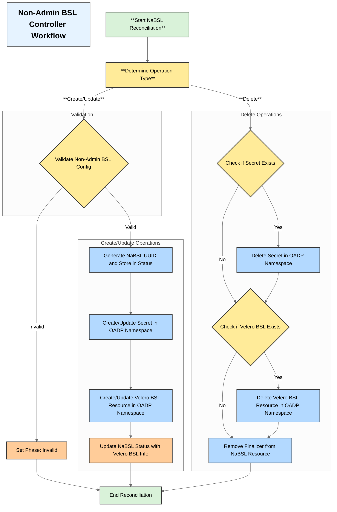

# NonAdminBackupStorageLocation Controller Design

## Overview
The `NonAdminBackupStorageLocation` controller is responsible for managing backup storage locations requested by non-admin users in a multi-tenant Kubernetes environment. It ensures that users can only access and manage backup storage locations within their authorized namespaces while maintaining security boundaries.

## Architecture

## Components

### 1. Controller Structure
- **Name**: NonAdminBackupStorageLocation
- **Type**: Kubernetes Custom Resource Controller
- **Scope**: Namespace-scoped
- **Watch Resources**: BackupStorageLocation CRD

### 2. Key Responsibilities
- Validate user permissions for Non-Admin BSL
- Manage Velero BSL lifecycle (create, update, delete)
- Manage Velero BSL Secret lifecycle (create, update, delete)
- Ensure namespace isolation
- Validate Non-Admin BSL configurations
- Update Non-Admin BSL status
- Generate and store Non-Admin BSL UUID in the NaBSL Status
- Use the UUID to create or update relevant resources

### 3. Security Considerations
- Prevention of cross-namespace access by ensuring that user can only point to the namespace Secret and the resulting Velero BSL resource will point to the secret in the OADP namespace

## Workflow

### Non-Admin BSL Creation Flow
1. User submits a Non-Admin BSL creation request.
2. Controller verifies the Non-Admin BSL configuration including existance of the secret in user's namespace.
3. Controller generates Non-Admin BSL UUID and stores it in the NaBSL Status.
4. Controller creates or updates a Secret in the OADP namespace based on the Non-Admin BSL UUID.
5. Controller creates a Velero BSL resource in the OADP namespace pointing to the Secret from the OADP namespace.
6. Controller updates the NaBSL Status with the information from the created Velero BSL resource.

### Non-Admin BSL Update Flow
1. User submits a Non-Admin BSL update request.
2. Controller validates changes
3. Controller updates the Secret and/or Velero BSL resource in the OADP namespace based on the Non-Admin BSL UUID.
4. Controller updates the NaBSL Status with the information from the updated Velero BSL resource.

### Deletion Flow
1. User deletes the Non-Admin BSL resource.
2. Controller deletes the Secret from the OADP namespace based on the Non-Admin BSL UUID.
3. Controller deletes the Velero BSL resource from the OADP namespace based on the Non-Admin BSL UUID.
4. Controller removes the finalizer from the Non-Admin BSL resource.
