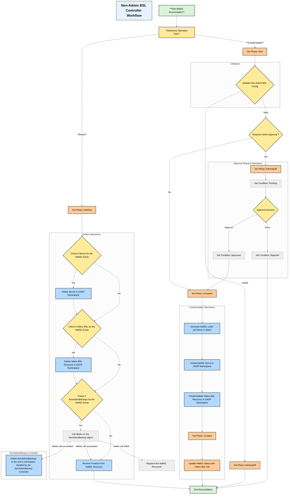

# NonAdminBackupStorageLocation Controller Design

## Overview
The `NonAdminBackupStorageLocation` controller is responsible for managing backup storage locations requested by non-admin users in a multi-tenant Kubernetes environment. It ensures that users can only access and manage backup storage locations within their authorized namespaces while maintaining security boundaries.

## Architecture



## Components

### 1. Controller Structure
- **Name**: NonAdminBackupStorageLocation
- **Type**: Kubernetes Custom Resource Controller
- **Scope**: Namespace-scoped
- **Watch Resources**: BackupStorageLocation CRD, NonAdminBackupStorageLocationApprovalRequest CRD

### 2. Key Responsibilities
- Validate user permissions for Non-Admin BSL
- Manage Velero BSL lifecycle (create, update, delete)
- Manage Velero BSL Secret lifecycle (create, update, delete)
- Ensure namespace isolation
- Validate Non-Admin BSL configurations
- Update Non-Admin BSL status
- Generate and store Non-Admin BSL UUID in the NaBSL Status
- Use the UUID to create or update relevant resources
- **Handle NABSL Approvals**: Process `NonAdminBackupStorageLocationApprovalRequest` to approve, reject or revoke NonAdminBackupStorageLocation requests.

### 3. Security Considerations
- Prevention of cross-namespace access by ensuring that user can only point to the namespace Secret and the resulting Velero BSL resource will point to the secret in the OADP namespace

## NonAdminBackupStorageLocationApprovalRequest

### Purpose
The `NonAdminBackupStorageLocationApprovalRequest` is a custom resource that allows non-admin users to request approval for creating or updating a backup storage location. This ensures that all backup storage locations are reviewed and approved by an admin before they are created or modified.

### Structure
- **Name**: NonAdminBackupStorageLocationApprovalRequest
- **Type**: Kubernetes Custom Resource
- **Scope**: Namespace-scoped (same namespace as the OADP operator)
- **Fields**:
  - `spec`: 
    - `pendingApprovalDecision`: allow cluster admin to approve or deny the request. The possible values are `approve`, `reject`, and `pending` (waiting for approval).
    - `revokeApprovedSpec`: if set to true, the entire BSL will be removed regardless of the `pendingApprovalDecision` and the `pendingApprovalDecision` will become "pending". The `approvedSpec` from the Status will be removed and the `pendingApprovalSpec` will be updated to the latest NonAdminBackupStorageLocation spec.
  - `status`:
    - `veleroBackupStorageLocationApprovalRequest`:
      - `pendingSpec`: the requested by the user Velero BSL spec. Once approved, the `approvedSpec` will be updated to this spec and the `pendingSpec` will be cleared.
      - `approvedSpec`: the approved Velero BSL spec.
      - `nacuuid`: the UUID of the NonAdminBackupStorageLocation.
      - `name`: the name of the NonAdminBackupStorageLocation.
      - `namespace`: the namespace of the NonAdminBackupStorageLocation.


#### Controller Decision Table for `NonAdminBackupStorageLocationApprovalRequest`

| **Revoke Approved Spec?** | **Pending Approval Decision** | **Controller Action**                                                                                             |
|---------------------------|-------------------------------|---------------------------------------------------------------------------------------------------------------------|
| **No**                     | **Pending** or **not set**   | Wait for approval decision from the admin.                                                                         |
| **No**                     | **Approve**                    | Approve the creation or update of the Velero BSL|
| **No**                     | **Reject**                     | Reject the creation or update of the Velero BSL, leaving the previously approved BSL unchanged.             |
| **Yes**                    | **any value**           | Revoke the previously approved `NonAdminBackupStorageLocation`. Set the status `pendingSpec`, clear the `approvedSpec` and set the `pendingApprovalDecision` Spec to `pending`. Remove Velero BSL and Secret from the OADP namespace if exists |

---

### **Notes:**
- **If `RevokeApprovedSpec` is `true`**, the controller will always revoke the previously approved `NonAdminBackupStorageLocation` and reset the approval status to **pending**, regardless of the `PendingApprovalDecision` value.
- **If `PendingApprovalDecision` is `approve`**, the controller will approve the spec, unless revocation has occurred.
- **If `PendingApprovalDecision` is `reject`**, the controller will reject the spec, leaving the approved spec unchanged unless it is revoked.
- If neither field is set, the controller will await an approval decision from the admin.

## Workflow

### Non-Admin BSL Creation Flow
#### (subpoints) are with Approval Request feature enabled
1. User submits a Non-Admin BSL creation request.
2. Controller verifies the Non-Admin BSL configuration including existance of the secret in user's namespace.
3. Controller generates Non-Admin BSL UUID and stores it in the NaBSL Status.
   - 3a. Controller creates the `NonAdminBackupStorageLocationApprovalRequest` in the OADP namespace with the Status containing the requested by the user Velero BSL spec in the `pendingApprovalSpec` field and the `approvalDecision` field set to `pending`.
   - 3b. The `NonAdminBackupStorageLocation` is updated with the new `ClusterAdminApproved` condition to `pending`.
   - 3c. The `NonAdminBackupStorageLocation` enters `BackingOff` Phase.
   - 3d. An admin reviews the request and updates the `NonAdminBackupStorageLocationApprovalRequest` spec `approvalDecision` field. If approved admin patches this spec field to `approve`.
   - 3e. ** Note: ** If the `approvalDecision` is set to `reject` the `NonAdminBackupStorageLocation` is updated with the new `ClusterAdminApproved` condition to `rejected` and the reconciliation is stopped.
   - 3f. The `NonAdminBackupStorageApprovalRequest` Status is updated and the `pendingApprovalSpec` is now within `approvedSpec`.
   - 3g. The `NonAdminBackupStorageLocation` spec is verified against `approvedSpec` from the `NonAdminBackupStorageLocationApprovalRequest` Status. If it matches, the `NonAdminBackupStorageLocation` is updated with the new `ClusterAdminApproved` condition to `approved` and the reconciliation is continued.
4. Controller creates or updates a Secret in the OADP namespace based on the Non-Admin BSL UUID.
5. Controller creates a Velero BSL resource in the OADP namespace pointing to the Secret from the OADP namespace.
6. Controller updates the NaBSL Status with the information from the created Velero BSL resource.

### Non-Admin BSL Update Flow
#### (subpoints) are with Approval Request feature enabled
** Note: ** If the cluster admin rejects the update, the previously approved `approvedSpec` remains active and the Velero BSL resource is not automatically deleted!

1. User submits a Non-Admin BSL update request.
2. Controller validates changes
   - 2a. Controller verifies the `NonAdminBackupStorageLocationApprovalRequest` Status contains the requested by the user Velero BSL spec in the `approvePendingSpec` field.
   - 2b. If the `approvePendingSpec` field satisfies the update, e.g. only `Credentials` were updated, the update is allowed and reconciliation is continued without change.
   - 2c. The `NonAdminBackupStorageLocationApprovalRequest` is updated with the Status containing the requested by the user Velero BSL spec update in the `pendingApprovalSpec` field and the `approvalDecision` field set to `pending`.
   - 2d. The workflow is continued similarly to the Non-Admin BSL Creation Flow from steps 3b->3g.
3. Controller updates the Secret and/or Velero BSL resource in the OADP namespace based on the Non-Admin BSL UUID.
4. Controller updates the NaBSL Status with the information from the updated Velero BSL resource.

### Enabling BSL Approval Request Feature
1. Cluster admin disables the Backup Storage Location Approval Request feature by updating the `DataProtectionApplication` spec `requireAdminApprovalForBSL` field to `false` or removing this field from the `nonAdmin` section of the `DataProtectionApplication` spec.

 ```yaml
   nonAdmin:
    enable: true
    requireAdminApprovalForBSL: true
```
2. NaBSL Controller restarts the NonAdminBackupStorageLocation controller to pick up the new feature flag.
3. NaBSL Contoller enters reconciliation loop for all existing NonAdminBackupStorageLocation resources.
4. NaBSL Controller deletes all Velero `BackupStorageLocation` resources from the OADP namespace that are referenced by the `NonAdminBackupStorageLocation` resources and does not have corresponding `NonAdminBackupStorageLocationApprovalRequest` resources.
5. NaBSL Controller continues standard reconciliation flows for either new or updated `NonAdminBackupStorageLocation` resources.


### Disabling BSL Approval Request Feature
1. Cluster admin disables the Backup Storage Location Approval Request feature by updating the `DataProtectionApplication` spec `requireAdminApprovalForBSL` field to `false` or removing this field from the `nonAdmin` section of the `DataProtectionApplication` spec.
 
 ```yaml
   nonAdmin:
    enable: true
    requireAdminApprovalForBSL: false
```
2. Controller restarts the NonAdminBackupStorageLocation controller to pick up the new feature flag.
3. Contoller enters reconciliation loop for all existing NonAdminBackupStorageLocation resources creates the corresponding Velero BSL resources and updates the NaBSL Status without any approval requests.
4. NonAdminBackupStorageLocation garbage collector controller deletes all `NonAdminBackupStorageLocationApprovalRequest` resources from the OADP namespace.


### Deletion Flow
1. User deletes the Non-Admin BSL resource.
2. NonAdminBSL Controller deletes the `NonAdminBackupStorageLocationApprovalRequest` resource from the OADP namespace based on the Non-Admin BSL UUID.
3. NonAdmin BSL Controller deletes the `Secret` from the OADP namespace based on the Non-Admin BSL UUID.
4. NonAdmin BSL Controller deletes the Velero `BackupStorageLocation` resource from the OADP namespace based on the Non-Admin BSL UUID.
5. NonAdmin BSL Controller calls delete on the `NonAdminBackup` objects for the NaBSL from the user's namespace based on the Non-Admin BSL UUID.
6. Non Admin Backup Controller deletes the `NonAdminBackup` objects from the user's namespace. This happens asynchronously. The `NonAdminBackup` objects may not be deleted immediately or may fail to be deleted, but this does not block the removal of finalizer from the `NonAdminBackupStorageLocation` resource. Please refer to the NonAdminBackup Controller design for more details about the NonAdminBackup Controller deletion flow.
7. NonAdmin BSL Controller removes the finalizer from the `NonAdminBackupStorageLocation` resource.
8. The `NonAdminBackupStorageLocation` resource is deleted.
