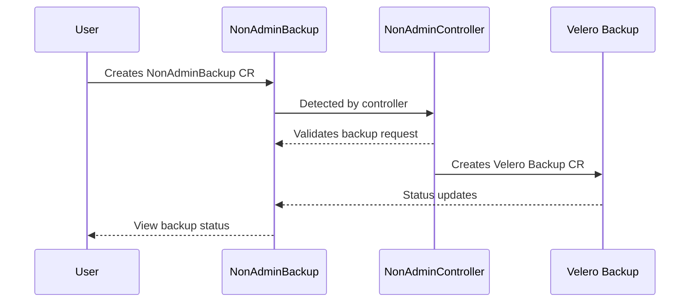

# OADP Self Service Overview

## Overview

OADP Self Service enables non-administrator users to perform backup and restore operations in their authorized namespaces without requiring cluster-wide administrator privileges. This feature provides secure self-service data protection capabilities while maintaining proper access controls.

### Key Benefits

- Allows users to perform namespace-scoped backup and restore operations
- Provides users with secure access to backup logs and status information
- Enables users to create dedicated backup storage locations
- Maintains cluster administrator control over non-administrator operations through 
templates and policies


## OADP Self Service Details

OADP self-service introduces a significant change to backup and restore operations in OpenShift. Previously, only cluster administrators could perform these operations. 
Now, regular OpenShift users can perform backup and restore operations within their authorized namespaces.  This is achieved through custom resources that securely manage these operations while maintaining proper access controls and visibility. The self-service functionality is implemented in a way that ensures users can only operate within their assigned namespaces and permissions, while cluster administrators maintain overall control through templates and policies.
 
### Glossary of terms

* **NAB**   - NonAdminBackup. A custom resource that users directly create to request a velero backup of the namespace from which the NAB object is created.  
* **NAR**   - NonAdminRestore. A custom resource that users directly create to request a velero restore of the namespace from which the NAR object is created.  
* **NAC**   - NonAdminController. A controller that validates the NAB and NAR objects and creates the velero backup and restore objects. The NAC is essentially a proxy between non admin users and velero.
* **NABSL** - NonAdminBackupStorageLocation. A custom resource that users directly create to request a velero backup storage location.  Users can use object storage that is specifically created for their project, deliniated from other users and projects.
* **NADR**  - NonAdminDownloadRequest. A custom resource that users directly create to request a velero backup download.  Users will be provided with a secured URL to download details regarding the backup or restore.

### Cluster Administrator Setup

Install and configure the OADP operator according to the documentation and your requirements.

To enable OADP Self-Service the DPA spec must the spec.nonAdmin.enable field to true.

```
  nonAdmin:
    enable: true
```

Once the OADP DPA is reconciled the cluster administrator should see the non-admin-controller running in the openshift-adp namespace.  The Openshift users without cluster admin rights will now be able to create NAB or NAR objects in their namespace to create a backup or restore.

## OpenShift User Instructions

Prior to OpenShift users taking advantage of OADP self-service feature the OpenShift cluster administrator must have completed the following prerequisite steps:

* The OADP DPA has been configured to support self-service
* The cluster administrator has created the users 
  * account 
  * namespace
  * namespace privileges, e.g. namespace admin.

Non Cluster Administrators can utilize OADP self-service by creating NonAdminBackup (NAB) and NonAdminRestore (NAR) objects in the namespace to be backed up or restored.  A NonAdminBackup is an OpenShift custom resource that securely facilitates the creation, status and lifecycle of a Velero Backup custom resource.  




For the most part one can think of a NonAdminBackup and a Velero Backup in very much the same way.  Both objects specify a velero backup and how the backup should be executed.  There are a few differences to keep in mind when creating a NonAdminBackup.

1. The NonAdminBackup creates the Velero Backup CR instance in a secure way that limits the users access.
2. A user cannot specify the namespace that will be backed up.  The namespace from which the NAB object is created is the defined namespace to be backed up.
3. In addition to the creation of the Velero Backup the NonAdminBackup object's main purpose is to track the status of the Velero Backup in a secure and clear way.

### NonAdminBackup NAB Example:

```
apiVersion: oadp.openshift.io/v1alpha1
kind: NonAdminBackup
metadata:
  name: mybackup-1
  namespace: nacuser1
spec:
  backupSpec:
    snapshotMoveData: true
```

Once created the NAB will look similar to the following:

```
apiVersion: oadp.openshift.io/v1alpha1
kind: NonAdminBackup
metadata:
  creationTimestamp: "2025-02-21T20:57:35Z"
  finalizers:
  - nonadminbackup.oadp.openshift.io/finalizer
  generation: 2
  name: mybackup-1
  namespace: nacuser1  <--- The namespace is set by the NAC controller
  resourceVersion: "20714121"
  uid: 93effb39-9762-4d04-8e9e-194ebe6b9b31
spec:
  backupSpec:
    snapshotMoveData: true  
status:
  conditions:
  - lastTransitionTime: "2025-02-21T20:57:35Z"
    message: backup accepted  <--- The NAC controller reconciled the NAB object and created the Velero Backup object
    reason: BackupAccepted
    status: "True"
    type: Accepted
  - lastTransitionTime: "2025-02-21T20:57:35Z"
    message: Created Velero Backup object
    reason: BackupScheduled
    status: "True"
    type: Queued
  phase: Created  <--- The NAB object is in the Created phase
  queueInfo:
    estimatedQueuePosition: 0  <--- The NAB object status in the queue, once complete it is set to 0
  veleroBackup:
    nacuuid: nacuser1-mybackup-1-588ce989-387e-4352-b04a-1fd6b7712370  <--- The NAC controller created the Velero Backup object and set the nacuuid
    name: nacuser1-mybackup-1-588ce989-387e-4352-b04a-1fd6b7712370 <--- The associated Velero Backup name
    namespace: openshift-adp
    status:  <--- The status of the Velero backup object displayed by the NAB object
      backupItemOperationsAttempted: 3
      backupItemOperationsCompleted: 3
      completionTimestamp: "2025-02-21T20:59:28Z"
      expiration: "2025-03-23T20:57:35Z"
      formatVersion: 1.1.0
      hookStatus: {}
      phase: Completed  <--- The Velero backup object is in the Completed phase, successful
      progress:
        itemsBackedUp: 57
        totalItems: 57
      startTimestamp: "2025-02-21T20:57:35Z"
      version: 1
```
The complete nonAdminBackup resource definition can be found here: [NonAdminBackup CRD](https://github.com/openshift/oadp-operator/blob/master/bundle/manifests/oadp.openshift.io_nonadminbackups.yaml)

### NonAdminRestore NAR Example:

```
apiVersion: oadp.openshift.io/v1alpha1
kind: NonAdminRestore
metadata:
  name: example
  namespace: nacuser1
spec: 
  restoreSpec:
    backupName: mybackup-1
```

Once created the NAR will look similar to the following:

```
apiVersion: oadp.openshift.io/v1alpha1
kind: NonAdminRestore
metadata:
  creationTimestamp: "2025-02-21T21:12:54Z"
  finalizers:
  - nonadminrestore.oadp.openshift.io/finalizer
  generation: 2
  name: example
  namespace: nacuser1
  resourceVersion: "20719136"
  uid: 0f1d8346-d8be-4621-8d67-0877f15e82fb
spec:
  restoreSpec:
    backupName: mybackup-1
    hooks: {}
    itemOperationTimeout: 0s
status:
  conditions:
  - lastTransitionTime: "2025-02-21T21:12:54Z"
    message: restore accepted  <--- The NAC controller reconciled the NAR object and created the Velero Restore object
    reason: RestoreAccepted
    status: "True"
    type: Accepted
  - lastTransitionTime: "2025-02-21T21:12:54Z"
    message: Created Velero Restore object  <--- The NAC controller created the Velero Restore object
    reason: RestoreScheduled
    status: "True"
    type: Queued
  phase: Created  <--- The NAR object is in the Created phase
  queueInfo:
    estimatedQueuePosition: 0  <--- The NAR object status in the queue, once complete it is set to 0
  veleroRestore:
    nacuuid: nacuser1-example-b844be97-7ee4-4702-91b8-ffc84697675a  <--- The NAC controller created the Velero Restore object and set the nacuuid
    name: nacuser1-example-b844be97-7ee4-4702-91b8-ffc84697675a  <--- The associated Velero Restore name
    namespace: openshift-adp
    status:
      completionTimestamp: "2025-02-21T21:12:57Z"
      hookStatus: {}
      phase: Completed  <--- The Velero restore object is in the Completed phase, successful
      progress:
        itemsRestored: 54
        totalItems: 54
      startTimestamp: "2025-02-21T21:12:55Z"
      warnings: 0
```
The complete nonAdminRestore resource definition can be found here: [NonAdminRestore CRD](https://github.com/openshift/oadp-operator/blob/master/bundle/manifests/oadp.openshift.io_nonadminrestores.yaml)


### NAB / NAR Status

#### Phase
The phase field is a simple one high-level summary of the lifecycle of the objects, that only moves forward. Once a phase changes, it can not return to the previous value.

| **Value** | **Description** |
|-----------|-----------------|
| New | *NonAdminBackup/NonAdminRestore* resource was accepted by the NAB/NAR Controller, but it has not yet been validated by the NAB/NAR Controller |
| BackingOff | *NonAdminBackup/NonAdminRestore* resource was invalidated by the NAB/NAR Controller, due to invalid Spec. NAB/NAR Controller will not reconcile the object further, until user updates it |
| Created | *NonAdminBackup/NonAdminRestore* resource was validated by the NAB/NAR Controller and Velero *Backup/restore* was created. The Phase will not have additional information about the *Backup/Restore* run |
| Deletion | *NonAdminBackup/NonAdminRestore* resource has been marked for deletion. The NAB/NAR Controller will delete the corresponding Velero *Backup/Restore* if it exists. Once this deletion completes, the *NonAdminBackup/NonAdminRestore* object itself will also be removed |


## Advanced Cluster Administrator Features

### Restricted NonAdminBackupStorageLocation 

Cluster administrators can gain efficiencies by delegating backup and restore operations to OpenShift users. It is recommended that cluster administrators carefully manage the NABSL to conform to any company policies, compliance requirements, etc.  There are two ways cluster administrators can manage the NABSL's.

Cluster administrators can optionally set an approval policy for any NABSL.  This policy will require that any NABSL be approved by the cluster administrator before it can be used.

```
  nonAdmin:
    enable: true
    requireAdminApprovalForBSL: true
```

```
apiVersion: oadp.openshift.io/v1alpha1
kind: NABSLApprovalRequest
metadata:
  name: nabsl-hash-name
  namespace: openshift-adp<Operator NS, this is the key here>
spec:
  nabslName: nabsl-name
  nabslNamespace: nac-user-ns
  creationApproved: false  # Tracks approval for creation
  updateApproved: false    # Tracks approval for updates
  lastApprovedSpec: {}  # Stores last approved NABSL spec
```
  This ensures the cluster administrator has reviewed the NABSL to ensure the correct object storage location options are used.

### Cluster Administrator Enforceable Spec Fields

Cluster administrators may also enforce company or compliance policy by utilizing templated NABSL's, NAB's and NAR's that require fields values to be set and conform to the administrator defined policy.  Admin Enforceable fields are fields that the cluster administrator can enforce non cluster admin users to use. Restricted fields are automatically managed by OADP and cannot be modified by either administrators or users.

#### NABSL
The following NABSL fields are currently supported for template enforcement:

| **NABSL Field**            | **Admin Enforceable** | **Restricted** |
|----------------------------|-----------------|----------------|
| `backupSyncPeriod`         | ⚠️ special case |                |
| `provider`                 | ⚠️ special case |                |
| `objectStorage`            | ✅ Yes          |                |
| `credential`               | ✅ Yes          |                |
| `config`                   | ✅ Yes          |                |
| `accessMode`               | ✅ Yes          |                |
| `validationFrequency`      | ✅ Yes          |                |

For example if the cluster administrator wanted to mandate that all NABSL's used a particular aws s3 bucket.

```
spec:
  config:
    checksumAlgorithm: ""
    profile: default
    region: us-west-2
  credential:
    key: cloud
    name: cloud-credentials
  default: true
  objectStorage:
    bucket: my-company-bucket <---
    prefix: velero
  provider: aws
```
The DPA spec must be set in the following way:  TODO GET NABSL ENFORCEMENT EXAMPLE

#### Restricted NonAdminBackups

In the same sense as the NABSL, cluster administrators can also restrict the NonAdminBackup spec fields to ensure the backup request conforms to the administrator defined policy.  Most of the backup spec fields can be restricted by the cluster administrator, below is a table of reference for the current implementation.


| **Backup Spec Field**                                  | **Admin Enforceable** | **Restricted** |
|--------------------------------------------|--------------|--------------------------|
| `csiSnapshotTimeout`                       | ✅ Yes       |                          |
| `itemOperationTimeout`                     | ✅ Yes       |                          |
| `resourcePolicy`                           | ✅ Yes       | ⚠️ special case           |
| `includedNamespaces`                       | ❌ No        | ✅ Yes                   |
| `excludedNamespaces`                       | ✅ Yes       |        ✅ Yes             |
| `includedResources`                        | ✅ Yes       |                          |
| `excludedResources`                        | ✅ Yes       |                          |
| `orderedResources`                         | ✅ Yes       |                          |
| `includeClusterResources`                  | ✅ Yes       |             ⚠️ special case               |
| `excludedClusterScopedResources`           | ✅ Yes       |                          |
| `includedClusterScopedResources`           | ✅ Yes       |        ⚠️ special case                    |
| `excludedNamespaceScopedResources`         | ✅ Yes       |                          |
| `includedNamespaceScopedResources`         | ✅ Yes       |                          |
| `labelSelector`                            | ✅ Yes       |                          |
| `orLabelSelectors`                         | ✅ Yes       |                          |
| `snapshotVolumes`                          | ✅ Yes       |                          |
| `storageLocation`                          | ⚠️ special case |                          |
| `volumeSnapshotLocations`                  | ⚠️ special case |                          |
| `ttl`                                      | ✅ Yes       |                          |
| `defaultVolumesToFsBackup`                 | ✅ Yes       |                          |
| `snapshotMoveData`                         | ✅ Yes       |                          |
| `datamover`                                | ✅ Yes       |                          |
| `uploaderConfig.parallelFilesUpload`       | ✅ Yes       |                          |
| `hooks`                                    | ⚠️ special case |                          |

An example enforcement set in the DPA spec to enforce the 
  * ttl to be set to "158h0m0s"
  * snapshotMoveData to be set to true

```
  nonAdmin:
    enable: true
    enforcedBackupSpec.ttl: "158h0m0s"
    enforcedBackupSpec.snapshotMoveData: true
```

#### Restricted NonAdminRestore NAR

NonAdminRestores spec fields can also be restricted by the cluster administrator.  The following NAR spec fields are currently supported for template enforcement:

| **Field**                     | **Admin Enforceable** | **Restricted**    |
|-------------------------------|--------------|--------------------|
| `backupName`                  | ❌ No        |                    |
| `scheduleName`                | ❌ No        | ✅ Yes         |
| `itemOperationTimeout`        | ✅ Yes       |                |
| `uploaderConfig`              | ✅ Yes       |                |
| `includedNamespaces`          | ❌ No        | ✅ Yes         |
| `excludedNamespaces`          | ❌ No        | ✅ Yes         |
| `includedResources`           | ✅ Yes       |                |
| `excludedResources`           | ✅ Yes       |                |
| `restoreStatus`               | ✅ Yes       |                |
| `includeClusterResources`     | ✅ Yes       |                |
| `labelSelector`               | ✅ Yes       |                |
| `orLabelSelectors`            | ✅ Yes       |                |
| `namespaceMapping`            | ❌ No        | ✅ Yes         |
| `restorePVs`                  | ✅ Yes       |                |
| `preserveNodePorts`           | ✅ Yes       |                |
| `existingResourcePolicy`      | ✅ Yes       |                |
| `resourceModifier`            | ⚠️ special case |                |
| `hooks`                       | ⚠️ special case |                |


## TODO
* add a section that describes which backup spec fields can be restricted by the cluster administrator https://github.com/migtools/oadp-non-admin/issues/151
* Document limited non-admin console use - via 
  * administrator -> Home -> API Explorer -> Filter on NonAdminBackup or NonAdminRestore -> Instances -> Create NonAdminBackup or NonAdminRestore
  