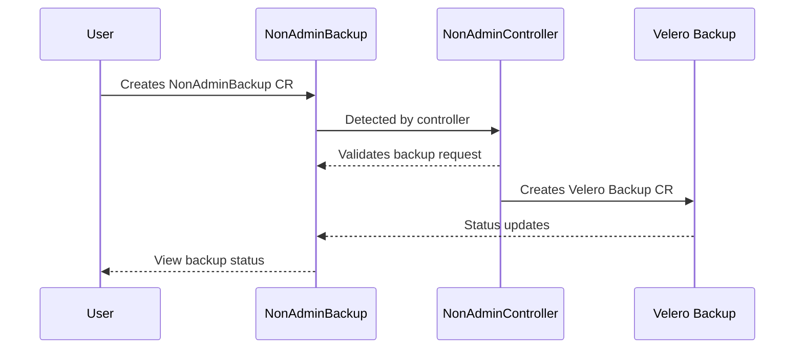

# OADP Self Service Documentation

## Overview

OADP Self Service enables non-administrator users to perform backup and restore operations in their authorized namespaces without requiring cluster-wide administrator privileges. This feature provides secure self-service data protection capabilities while maintaining proper access controls.

### Key Benefits

- Allows namespace-scoped backup and restore operations
- Provides secure access to backup logs and status information
- Enables users to create dedicated backup storage locations
- Maintains cluster administrator control over non-administrator operations through templates and policies

### Components

The self-service functionality is implemented through several custom resources:

- NonAdminBackup (NAB) - Manages namespace-scoped backup operations
- NonAdminRestore (NAR) - Handles namespace-scoped restore operations  
- NonAdminBackupStorageLocation (NABSL) - Defines user-specific backup storage locations
- NonAdminController (NAC) - Controls and orchestrates the self-service operations

## OADP Self Service

Previously, the OADP (OpenShift API for Data Protection) Operator required cluster administrator privileges to perform any backup and restore operations. With OADP self-service, regular users can now safely perform backup and restore operations within namespaces where they have appropriate permissions.
OADP self-service enables regular OpenShift users to perform backup and restore operations within their authorized namespaces. This is achieved through custom resources that securely manage these operations while maintaining proper access controls and visibility. Users can:

- Create and manage backups of their authorized namespaces
- Restore data to their authorized namespaces 
- Monitor backup and restore status
- Access relevant logs and descriptions
- Configure their own backup storage locations

The self-service functionality is implemented in a way that ensures users can only operate within their assigned namespaces and permissions, while cluster administrators maintain overall control through templates and policies.
 
## Glossary of terms
* NAB - Non Admin Backup
* NAR - Non Admin Restore
* NAC - Non Admin Controller
* NABSL - Non Admin Backup Storage Location


## Cluster Administrator Setup

Install and configure the OADP operator according to the documentation and your requirements.

To enable OADP Self-Service the DPA spec must have these 2 things:

```
  nonAdmin:
    enable: true
  unsupportedOverrides:
    tech-preview-ack: "true"
```

Once the OADP DPA is reconciled the cluster administrator should see the non-admin-controller running in the openshift-adp namespace.

The Openshift users without cluster admin rights can create NAB objects in their namespace to create a backup.

## OpenShift User Instructions

Prior to OpenShift users taking advantage of OADP self-service feature the OpenShift cluster administrator must have completed the following prerequisite steps:

* The OADP DPA has been configured to support self-service
* The cluster administrator has created the users 
  * account 
  * namespace
  * namespace admin privileges

Non Cluster Administrators can utilize OADP self-service by creating NonAdminBackup (NAB) and NonAdminRestore (NAR) objects in the namespace to be backed up or restored.  A NonAdminBackup is an OpenShift custom resource that securely facilitates the creation, status and lifecycle of a Velero Backup custom resource.  




For the most part one can think of a NonAdminBackup and a Velero Backup in very much the same way.  Both objects specify a velero backup and how the backup should be executed.  There are a few differences to keep in mind when creating a NonAdminBackup.

1. The NonAdminBackup creates the Velero Backup CR instance in a secure way that limits the users access.
2. A user cannot specify the namespace that will be backed up.  The namespace from which the NAB object is created is the defined namespace to be backed up.
3. In addition to the creation of the Velero Backup the NonAdminBackup object's main purpose is to track the status of the Velero Backup in a secure and clear way.


### NAB / NAR Status

#### Phase
The phase field is a simple one high-level summary of the lifecycle of the objects, that only moves forward. Once a phase changes, it can not return to the previous value.

| **Value** | **Description** |
|-----------|-----------------|
| New | *NonAdminBackup/NonAdminRestore* resource was accepted by the NAB/NAR Controller, but it has not yet been validated by the NAB/NAR Controller |
| BackingOff | *NonAdminBackup/NonAdminRestore* resource was invalidated by the NAB/NAR Controller, due to invalid Spec. NAB/NAR Controller will not reconcile the object further, until user updates it |
| Created | *NonAdminBackup/NonAdminRestore* resource was validated by the NAB/NAR Controller and Velero *Backup/restore* was created. The Phase will not have additional information about the *Backup/Restore* run |
| Deletion | *NonAdminBackup/NonAdminRestore* resource has been marked for deletion. The NAB/NAR Controller will delete the corresponding Velero *Backup/Restore* if it exists. Once this deletion completes, the *NonAdminBackup/NonAdminRestore* object itself will also be removed |


