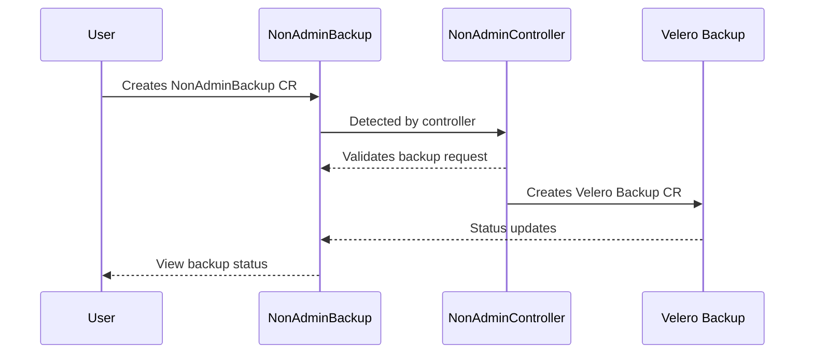

# test

```mermaid
sequenceDiagram
    participant User
    participant NAB as NonAdminBackup
    participant NAC as NonAdminController
    participant VB as Velero Backup

    User->>NAB: Creates NonAdminBackup CR
    NAB->>NAC: Detected by controller
    NAC-->>NAB: Validates backup request
    NAC->>VB: Creates Velero Backup CR
    VB-->>NAB: Status updates
    NAB-->>User: View backup status
```
